# Walmart Sales Forecasting - გაყიდვების პროგნოზირების პროექტი

Kaggle contest [Walmart Recruiting - Store Sales Forecasting](https://www.kaggle.com/competitions/walmart-recruiting-store-sales-forecasting)

საუკეთესო შედეგი: **Prophet - Kaggle Public 2755.07 / Private 2830.03 (WMAE)**.

---

## სარჩევი

1. [პროექტის მიმოხილვა და არქიტექტურების კვლევის მიდგომა](#1-პროექტის-მიმოხილვა-და-არქიტექტურების-კვლევის-მიდგომა)
2. [მონაცემების წინასწარი დამუშავება](#2-მონაცემების-წინასწარი-დამუშავება)
3. [Feature Engineering და ვალიდაციის სტრატეგია](#3-feature-engineering-და-ვალიდაციის-სტრატეგია)
4. [მოდელები](#4-მოდელები)
5. [ინფერენსის ნოუთბუქი (`model_inference.ipynb`)](#5-ინფერენსის-ნოუთბუქი-model_inferenceipynb)
6. [მოდელების შედარება](#6-მოდელების-შედარება)
7. [საბოლოო მოდელის არჩევანი](#7-საბოლოო-მოდელის-არჩევანი)
8. [დასკვნები და შეზღუდვები](#8-დასკვნები-და-შეზღუდვები)

---

## 1. პროექტის მიმოხილვა და არქიტექტურების კვლევის მიდგომა

### 1.1 ამოცანა და მეტრიკა

მოცემულია Walmart-ის 45 მაღაზიის ყოველკვირეული გაყიდვები დეპარტამენტების ჭრილში (`train.csv`: 421,570 სტრიქონი, 2010-02-05 - 2012-11-01), ასევე გარე ფაქტორები (`features.csv`: ტემპერატურა, საწვავის ფასი, CPI, უმუშევრობა, MarkDown1-5 ფასდაკლებები) და მაღაზიების მეტამონაცემები (`stores.csv`: ტიპი, ზომა). საპროგნოზოა `test.csv`-ის პერიოდი: 2012-11-02 - 2013-07-26, ანუ ~39 კვირა ტრენინგის დასრულების შემდეგ - ჯამში 115,064 (Store, Dept, Date) კომბინაცია.

შეფასების metric: **WMAE (Weighted Mean Absolute Error)** - სადღესასწაულო კვირებს (Super Bowl, Labor Day, Thanksgiving, Christmas) აქვთ **5-ჯერ მეტი წონა**, ვიდრე ჩვეულებრივს. ეს metric იმპლემენტირებულია `src/evaluation.py`-ის `weighted_mae()` ფუნქციაში და ყველა მოდელი სწორედ ამით ფასდება, და არა უბრალო MAE-თი.

მეტრიკის ამ თვისებას ორი პრაქტიკული შედეგი აქვს:

- მოდელი, რომელიც "საშუალოდ" კარგია, მაგრამ პიკებს ვერ იჭერს, დაბალ WMAE აიღებს.
- სავალიდაციო პერიოდში სადღესასწაულო კვირების არსებობა/არარსებობა პირდაპირ ცვლის შეფასების სანდოობას (იხ. ქვემოთ CV-ის შეზღუდვა).

### 1.2 არქიტექტურული ჯგუფების კვლევა იმპლემენტაციამდე

სანამ კონკრეტულ მოდელებს ავაწყობდით, თითოეული არქიტექტურული ჯგუფისთვის ცალკე გავიაზრეთ, რას ელოდება ის მონაცემისგან და როგორ უნდა მიეწოდოს მას ეს ამოცანა - რადგან ერთი და იგივე მონაცემი სამივე ოჯახისთვის სრულიად სხვადასხვანაირად უნდა დამუშავდეს:

**ხეებზე დაფუძნებული მოდელები (XGBoost, LightGBM).** gradient boosting time-series ვერ "ხედავს" - ის ტაბულარულ ამოცანას ხსნის, ამიტომ ეს დროითი სტრუქტურა ფიჩერებად უნდა ვაქციოთ: ლაგები, მოძრავი საშუალოები, კალენდარული ნიშნები, აგრეგატები. ტესტი ტრენინგის ბოლოდან 39 კვირას სწვდება, ამიტომ მოკლე ლაგები (1, 4, 13, 26 კვირა) ტესტზე უბრალოდ არ არსებობს.

**კლასიკური სტატისტიკური მოდელები (ARIMA/SARIMA, Prophet).** აქ პირიქით - მოდელი თავად შლის მწკრივს ტრენდად, სეზონურობად და ნარჩენად, feature engineering თითქმის არ სჭირდება. თუმცა აქ დასადგენი იყო: სტაციონარულია თუ არა მწკრივი (ADF ტესტი), რა პერიოდის სეზონურობაა (52 კვირა), და როგორ გავუმკლავდეთ იმას, რომ საჭიროა არა ერთი გლობალური მოდელი, არამედ ~2,900 დამოუკიდებელი (Store, Dept) მწკრივის მორგება. ARIMA-ს შემთხვევაში თეორიული გააზრება იყო მიზანი (ACF/PACF/დეკომპოზიციის დიაგნოსტიკა), Prophet-ის შემთხვევაში კი - სადღესასწაულო ეფექტების მოდელირება `holidays` კომპონენტით.

**deep learning სწავლება (N-BEATS, TFT, DLinear).** ~3,300 ცალკეული მწკრივი თითო-თითოდ ნეირონული ქსელზე ვერ ისწავლება, ამიტომ საჭიროა **გლობალური მოდელი**, რომელიც ყველა მწკრივზე ერთდროულად ტრენინგდება (darts ბიბლიოთეკის API). N-BEATS მხოლოდ წარსულ მნიშვნელობებს ხედავს (past covariates), TFT კი მომავალშიც ცნობილ ფიჩერებსაც იღებს (future covariates - მაგ. დღესასწაულამდე დარჩენილი დღეები). ეს განსხვავება შედეგებში პირდაპირ აისახა (იხ. სექციები 4.5-4.6).

**foundation მოდელი (TimesFm).** Google-ის წინასწარ გაწვრთნილი მოდელი zero-shot რეჟიმში, ანუ ჩვენს მონაცემზე საერთოდ არ წვრთნება.

### 1.3 ინფრასტრუქტურა

საერთო ინფრასტრუქტურა, რომელსაც ორივე ტრეკი უცვლელად იყენებს, `src/`-შია: `preprocessing.py`, `features.py`, `evaluation.py`, `validation.py`, `pipeline.py`. ექსპერიმენტების ტრეკინგი - საერთო MLflow სერვერზე (DagsHub: [DagsHub MLflow Server](https://dagshub.com/NikaMikeltadze/walmart-sales-forecasting.mlflow)), თითო არქიტექტურაზე თითო ექსპერიმენტი (`XGBoost_Training`, `Prophet_Training`, ...) და სტანდარტიზებული run-სახელები (`{Model}_{Stage}`), რომ WMAE-ები პირდაპირ შედარებადი იყოს.

ყველა მოდელი შენახულია **Pipeline-ად**, რომელიც დაუმუშავებელ `test.csv`-ის ფორმის მონაცემს იღებს და მთელ პრეპროცესინგს შიგნით აკეთებს - ეს `model_inference.ipynb`-ის მოთხოვნაა.

---

## 2. მონაცემების წინასწარი დამუშავება

მთელი ლოგიკა `src/preprocessing.py`-შია, რომ ორივე ტრეკმა იდენტური მონაცემი მიიღოს:

- **ჩატვირთვა (`load_raw_data`)**: Kaggle-ის zip-ს ცოტა უცნაური ფორმატი ჰქონდა- `train.csv`, `test.csv` და `features.csv` სინამდვილეში *დირექტორიებია*, რომლებშიც ამავე სახელის CSV იდო (`data/raw/train.csv/train.csv`), ხოლო `stores.csv` და `sampleSubmission.csv` პირდაპირ ცსვ ფაილებია.
- **`_fill_macro_gaps`**: `CPI` და `Unemployment` სატესტო პერიოდში NaN-ია - ივსება forward-fill-ით მაღაზიის ჭრილში. ეს გამართლებულია, რადგან ორივე ნელა ცვალებადი მაჩვენებელია.
- **გაერთიანება (`merge_external`)**: train/test ფრეიმი უერთდება `features`-ს და `stores`-ს; `features`-ის დუბლირებული `IsHoliday` სვეტი იყრება.
- **გაწმენდა (`clean`)**: `MarkDown1`-`MarkDown5`-ის NaN-ები ივსება 0-ით ("იმ კვირას ფასდაკლება არ იყო"), type ები ნორმალიზდება (`Store`/`Dept` - int, `Type` - category, `IsHoliday` - bool).
- **`WalmartPreprocessor`** - sklearn-თავსებადი `TransformerMixin`, რომელიც ამ ყველაფერს Pipeline-ის პირველ საფეხურად აქცევს: `fit()` ცხრილებს ტვირთავს და იმახსოვრებს, `transform()` ნებისმიერ raw frameს ამუშავებს.

- `MarkDown1`-`5` **2011-11-11-მდე თითქმის მთლიანად ცარიელია** (ველი უბრალოდ არ არსებობდა). 0-ით შევსება აერთიანებს ორ სხვადასხვა მდგომარეობას - "ფასდაკლება არ იყო" და "მონაცემი არ არსებობდა". ეს გაცნობიერებული კომპრომისია: ხის მოდელებზე ablation-ექსპერიმენტებმა აჩვენა, რომ MarkDown-ების დატოვება მაინც აუმჯობესებს WMAE-ს (იხ. სექცია 4.1).
- `Weekly_Sales`-ის მცირე ნაწილი **ნულოვანი ან უარყოფითია** (დაბრუნებები/არააქტიური დეპარტამენტები). ეს არ გაფილტრულა გლობალურად - თითო მოდელი თავად წყვეტს (მაგ. Prophet და ARIMA პროგნოზებს 0-ზე ჭრიან, ხის მოდელები - არა; ამის შედეგები კარგად ჩანს სექცია 6-ის ანალიზში).
- მონაცემში საშობაო დღესასწაულად **წლის ბოლო კვირაა** მონიშნული, რეალური გაყიდვების პიკი კი ერთი კვირით ადრეა (51-ე კვირა, ~21 დეკემბერი). ეს ნიშნავს, რომ `IsHoliday`-ს ბრმად ნდობა შობის გარშემო შეცდომაა - ამიტომ ფიჩერებში კალენდარული დისტანციები დაემატა (იხ. სექცია 3.1). ეს დაკვირვება პროგნოზების ანალიზშიც დადასტურდა: ყველა კარგმა მოდელმა 51-ე კვირაზე მკვეთრად მეტი დააფრედიქტა, ვიდრე მონიშნულ "საშობაო" კვირაზე.

---

## 3. Feature Engineering და ვალიდაციის სტრატეგია

### 3.1 ფიჩერები (`src/features.py`)

- **`add_temporal_features()`** - კალენდარული ნიშნები: `week_of_year`, `month`, `year` და ნიშნიანი დისტანციები ოთხივე დღესასწაულამდე (`days_to_super_bowl`, `days_to_labor_day`, `days_to_thanksgiving`, `days_to_christmas`). დისტანციები სწორედ 51-ე კვირის პრობლემას აგვარებს - მოდელს შეუძლია ისწავლოს "შობამდე 7-10 დღით ადრე პიკია", `IsHoliday`-სგან დამოუკიდებლად. გაჟონვის რისკი არ აქვს - მომავლის კალენდარი წინასწარ ცნობილია.
- **`WalmartFeatureEngineer`** (sklearn transformer) - `fit()` მხოლოდ ტრეინზე ეშვება და აგებს ისტორიის ცხრილს (`history_`) და აგრეგატებს (`store_mean_`, `dept_mean_`, `store_dept_mean_`, `global_mean_`); `transform()` ამატებს ამ აგრეგატებს, ლაგებს `[1, 4, 13, 26, 52]` კვირაზე და მოძრავ mean/std-ს `[4, 13, 52]`-კვირიან ფანჯრებზე. ტრეინში უნახავი (Store, Dept) კომბინაციებისთვის fallback-ად `global_mean_` გამოიყენება.
- **`update_history()`** - რეკურსიული ინფერენსისთვის: ახალი პროგნოზები ისტორიას ემატება და შემდეგი კვირის ლაგები უკვე მათზე ითვლება.

### 3.2 Far-horizon ფიქსი - პროექტის ყველაზე მნიშვნელოვანი გადაწყვეტილება

ტესტი ტრენინგის ბოლოდან ~39 კვირას წვდება. ეს ნიშნავს, რომ სატესტო სტრიქონების **~95%-ისთვის მოკლე ლაგები (`sales_lag_1/4/13/26`) და ყველა rolling ფიჩერი NaN-ია** - ის ისტორია, საიდანაც უნდა ამოვიდეს მათი მნიშვნელობა, უბრალოდ ჯერ არ არსებობს. ერთადერთი ლაგი, რომელიც ყოველთვის ტრეინში სწვდება, `sales_lag_52`-ია.

პირველი XGBoost submission სრული ფიჩერ-სეტით გაკეთდა და Kaggle-ზე **Public 5101 / Private 5279** მიიღო - ბევრად უარესი, ვიდრე CV აფრედიქთებდა. მიზეზი: ტრენინგზე მოდელი მოკლე ლაგებს ეყრდნობოდა, ტესტზე კი ისინი NaN-ია და პროგნოზები XGBoost-ის NaN-default branchebze "იშლებოდა". **ფინალური მოდელი მხოლოდ ტესტ-ჰორიზონტზე ხელმისაწვდომ ფიჩერებზე დავატრენინგეთ** - `WalmartFeatureEngineer(lag_weeks=[52], rolling_weeks=[])`. შედეგი: **Public 2858 / Private 3027, ანუ -44%/-43% გაუმჯობესება**.

### 3.3 ვალიდაციის სტრატეგია (`src/validation.py`)

- **მხოლოდ დროზე დაფუძნებული სპლიტები** - შემთხვევითი სპლიტი დროით მწკრივზე მომავლის მონაცემს leakavs ტრეინში. ორივე ერთიდაიგივე სპლიტერს იყენებს, რომ WMAE-ები შედარებადი იყოს.
- **`expanding_window_splits`** - თითო fold-ი მთელ ისტორიაზე წვრთნება `train_end`-მდე და მომდევნო 13 კვირაზე მოწმდება; **`sliding_window_splits`** - ფიქსირებული ტრენინგ-ფანჯრით, ძვირი refit-ის შემთხვევებისთვის (ARIMA).
- Fold-ები თარიღების საზღვრებადაა გამოხატული (`Split` dataclass), არა ინდექსებად - ერთი და იგივე განსაზღვრება მუშაობს flat DataFrame-ზეც და darts `TimeSeries`-ზეც.
- **`describe_split`** ლოგავს `n_holidays_in_val`-ს - fold-ი, რომლის ვალიდაციაშიც არცერთი დღესასწაული არ ხვდება, ნაკლებად სანდო WMAE-ს იძლევა.

**მოცემული შეზღუდვა:** ტრეინი 2012-11-01-ზე მთავრდება, ამიტომ 3 expanding-window fold-იდან **ვერცერთი ვერ შეიცავს Thanksgiving-ის ან შობის სავალიდაციო კვირას** - ისინი ყოველთვის ტრეინის მხარეს რჩებიან. სწორედ ამიტომ იყო სრული ფიჩერ-სეტის CV WMAE (2587) ოპტიმისტური რეალურ ჰორიზონტთან შედარებით, და ამიტომ დაემატა Prophet-ს ცალკე "TESTLIKE" ვალიდაცია (იხ. სექცია 4.4).

**Fold-ებში leak პრევენცია:** `src/pipeline.py`-ის `build_cv_frames()` თითო fold-ზე **ახალ** `WalmartFeatureEngineer`-ს არგებს მხოლოდ იმ fold-ის ტრეინ-სტრიქონებზე - წინააღმდეგ შემთხვევაში აგრეგატებში fold-ის საკუთარი სავალიდაციო გაყიდვები გაჟონავდა.

---

## 4. მოდელები

ყველა ქვესექცია ერთიან შაბლონს მიჰყვება: რა მიდგომები გაიტესტა (MLflow გაშვებების შესაბამისი სახელებით), საბოლოო Kaggle ქულა, გრაფიკები და მათი ანალიზი, პლუს უშუალოდ სუბმიშენის ფაილში არსებული პროგნოზების ქცევის მიმოხილვა.

### 4.1 XGBoost

**Kaggle რეიტინგი:** Public: 2858.00 / Private: 3027.00 | **MLflow ექსპერიმენტი:** `XGBoost_Training` (სულ 10 გაშვება)

**ექსპერიმენტების ეტაპები (გაშვებების მიხედვით):**

| გაშვება (Run) | ექსპერიმენტის შინაარსი | მიღებული შედეგი |
| :--- | :--- | :--- |
| `XGBoost_CV_HolidayWeight_Off` / `On` | სადღესასწაულო კვირებისთვის 5x `sample_weight`-ით დატვირთვა | **წონიანმა ვერსიამ გაიმარჯვა** — `WMAE`-ს 5-მაგი წონა ტრენინგის ეტაპზევე წარმატებით აისახა |
| `XGBoost_CV_MarkDown_Off` | `MarkDown1-5` ცვლადების ამოღების ეფექტის (ablation study) შემოწმება | ამ ცვლადების მოხსნამ `WMAE` გააუარესა — შესაბამისად, დარჩა მოდელში |
| `XGBoost_CV_Macro_Off` | მაკროეკონომიკური ცვლადების (`CPI`, `Unemployment`, `Fuel_Price`, `Temperature`) მოხსნის ეფექტის შემოწმება | მათმა ამოღებამ შედეგი გააუარესა — შესაბამისად, დარჩა მოდელში |
| `XGBoost_CV_HP_1`–`HP_4` | ჰიპერპარამეტრების 4-კომბინაციანი ოპტიმიზაცია (Grid/Random Search) | საუკეთესო კომბინაცია: `max_depth=8, n_estimators=500, learning_rate=0.03, subsample=0.8` (კროს-ვალიდაციის WMAE: **2587.20**) |
| `XGBoost_CV_RecursiveInference` | კვირიდან კვირამდე რეკურსიული ინფერენსი `update_history()` მეთოდის გამოყენებით | შედარდა პირდაპირი ინფერენსის (direct inference) მიდგომასთან |
| `XGBoost_Final` | ფინალური პაიპლაინის ფორმირება შორსმჭვრეტელი ჰორიზონტის ფიქსით (far-horizon fix) | გამოყენებულია მონაცემთა ნაკრები: `feature_set="test_horizon_safe"` |

**მოდელის პაიპლაინი (Pipeline):** `WalmartPreprocessor` → `add_temporal_features` → `WalmartFeatureEngineer` → `ModelFeatureSelector` → `XGBRegressor(enable_categorical=True, tree_method="hist")`.

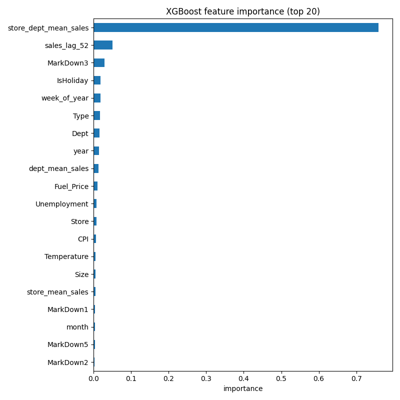

**გრაფიკის ანალიზი**
ცვლადების მნიშვნელოვნება (feature importance) უკიდურესად კონცენტრირებულია: `store_dept_mean_sales` მარტო **~76%-ს** იკავებს, `sales_lag_52` — დაახლოებით 5%-ს, ხოლო ყველა დანარჩენი კომპონენტი (`MarkDown3`, `IsHoliday`, `week_of_year`, `Type`, `Dept`) — ჯამში სულ რამდენიმე პროცენტს. ეს ანალიზი ორ უმნიშვნელოვანეს გარემოებაზე მიუთითებს:

1. მოცემულ ამოცანაში ძირითადი სიგნალის ლომის წილი მოდის მასშტაბის ცვლადზე — ანუ იმაზე, თუ „საშუალოდ რამხელაა გაყიდვების მოცულობა კონკრეტული Store/Dept წყვილისთვის“. ყველა სხვა ცვლადი მხოლოდ ამ ბაზისური მასშტაბის გარშემო არსებულ რხევებს აზუსტებს.
2. შორსმჭვრეტელი ჰორიზონტის ფიქსის (far-horizon fix) შემდეგ მოდელს, 52-კვირიანი ლაგისა და აგრეგირებული მაჩვენებლების გარდა, დასაყრდენი პრაქტიკულად აღარ აქვს. ეს არის გაცნობიერებული დათმობა მოდელის ვალიდურობისა და სისწორის სასარგებლოდ. 

ასევე, საგულისხმოა `MarkDown3`-ის მესამე ადგილი — ეს ცვლადი ზუსტად მადლიერების დღის (Thanksgiving) პერიოდის ფასდაკლებებს ასახავს, რაც იმას ნიშნავს, რომ მოდელმა მისგან ძლიერი სადღესასწაულო სიგნალი ამოიღო.

**პროგნოზების ქცევა (`submissions/xgboost_submission.csv`)**
მონაცემთა ნაკრები მოიცავს 115,064 პროგნოზს, სადაც საშუალო მაჩვენებელი 16,798-ს შეადგენს, ხოლო მედიანა — 7,954-ს (მარჯვნივ ძლიერ ასიმეტრიული განაწილება, რაც ზუსტად იმეორებს რეალური გაყიდვების სტრუქტურას). დაფიქსირდა **2,105 უარყოფითი პროგნოზი (1.83%, მინიმალური მნიშვნელობით -1,985)** — მოდელი დაბალგაყიდვად დეპარტამენტებში ნულს ქვემოთაც ჩადის. ეს მაჩვენებლები ხელოვნურად არ ჩამოგვიჭრია, რადგან ტრენინგის მონაცემებშიც გვხვდება უარყოფითი გაყიდვები (ნივთების დაბრუნების ხარჯზე). 

სადღესასწაულო კვირების დინამიკა სრულიად ჯანსაღია: მადლიერების დღის (Thanksgiving) კვირაში საშუალო საპროგნოზო მაჩვენებელი 22,878-მდე იზრდება (წინა კვირის 16,117-ის ფონზე), ხოლო 51-ე კვირას 24,939-ს აღწევს, მაშინ როდესაც უშუალოდ მონიშნულ „საშობაო“ კვირაზე იგი მხოლოდ 16,270-ია. ეს ადასტურებს, რომ მოდელმა კალენდარული დისტანციების დახმარებით ზუსტად ისწავლა, რომ რეალური გაყიდვების პიკი 51-ე კვირაში ფიქსირდება და არა `IsHoliday` ინდიკატორში.

### 4.2 LightGBM

**Kaggle რეიტინგი:** Public: 3034.98 / Private: 3166.01 | **MLflow ექსპერიმენტი:** `LightGBM_Training` (სულ 10 გაშვება)

ეს ნოუთბუქი სტრუქტურულად ზუსტად იმეორებს XGBoost-ის ეტაპებს — ფაილი `src/pipeline.py` განზრახ შეიქმნა მოდელ-აგნოსტიკურ არქიტექტურაზე და აქ უცვლელად იქნა გამოყენებული. გაშვებების (runs) სქემაც იდენტურია: `LightGBM_CV_HolidayWeight_Off/On`, `LightGBM_CV_MarkDown_Off`, `LightGBM_CV_Macro_Off`, `LightGBM_CV_HP_1`–`HP_4`, `LightGBM_CV_RecursiveInference` და `LightGBM_Final`.

**LightGBM-სპეციფიკური მიგნებები:**

* **`subsample_freq=1` პარამეტრის აუცილებლობა:** ეს პარამეტრი კრიტიკულია `subsample`-თან ერთად გამოსაყენებლად — LightGBM ნაგულისხმევად (როცა `subsample_freq=0`) აიგნორებს `subsample` მაჩვენებელს. ამ ნიუანსის გაუთვალისწინებლად, XGBoost-ის ჰიპერპარამეტრების გრიდიდან გადმოტანილი ქვესემპლირების ექსპერიმენტები ყოველგვარი ეფექტის გარეშე (no-op) ჩაივლიდა.
* **შეწონილი ტრენინგის შედეგი:** განსხვავებით XGBoost-ისგან, შეწონილმა სწავლებამ აქ უარესი შედეგი აჩვენა — შეუწონავმა (unweighted) ვერსიამ დააფიქსირა 3090.31, ხოლო შეწონილმა (weighted) — 3370.41. ეს მიგნება კარგი მაგალითია იმისა, რომ ერთი და იგივე მიდგომა გრადიენტული ბუსტინგის სხვადასხვა იმპლემენტაციაზე რადიკალურად განსხვავებულად მუშაობს.
* **ცვლადების მოხსნის ეფექტი (Ablation study):** დასკვნები უცვლელი დარჩა — მოდელში შენარჩუნდა როგორც `MarkDown` ცვლადები, ისე მაკროეკონომიკური პარამეტრები.
* **ოპტიმალური ჰიპერპარამეტრები:** საუკეთესო შედეგი აჩვენა იმავე კომბინაციამ (`max_depth=8, n_estimators=500, learning_rate=0.03, subsample=0.8`), თუმცა კროს-ვალიდაციის WMAE გამოვიდა **2953.33** (რაც მნიშვნელოვნად ჩამორჩება XGBoost-ის 2587-იან ნიშნულს). ეს ჩამორჩენა Kaggle-ის ლიდერბორდზეც აისახა (3034.98 vs 2858.00). რეკურსიულმა ინფერენსმა ბოლო Fold-ზე 1661.82 ქულა დააფიქსირა.

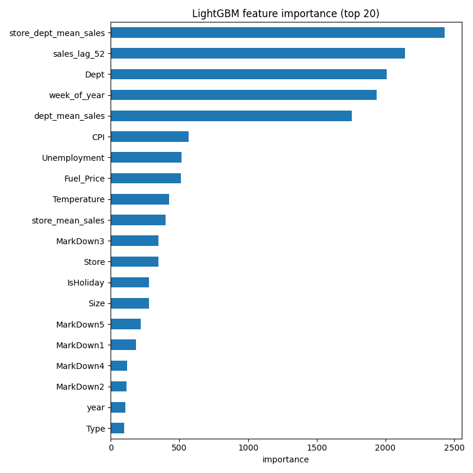

**გრაფიკის ანალიზი**
LightGBM-ის ცვლადების მნიშვნელოვნება (რომელიც ეფუძნება split-ების რაოდენობას) ბევრად უფრო თანაბრადაა გადანაწილებული, ვიდრე XGBoost-ის სურათი, სადაც შეფასება ინფორმაციის მატებაზე (gain) იყო დაფუძნებული. აქ `store_dept_mean_sales` (~2,400) და `sales_lag_52` (~2,150) კვლავ ლიდერობენ, თუმცა მათ მცირედით ჩამორჩებიან `Dept` (~2,000), `week_of_year` (~1,950) და `dept_mean_sales` (~1,750). 

ეს ნაწილობრივ თავად მეტრიკის სპეციფიკით აიხსნება (split count vs gain), თუმცა იმაზეც მიუთითებს, რომ LightGBM მეტ განშტოებას (split) ხარჯავს კალენდარულ და იდენტიფიკატორ ცვლადებზე. მაკროეკონომიკური ცვლადები (`CPI`, `Unemployment`, `Fuel_Price`, `Temperature`) გრაფიკის შუა ზონაში მოხვდა, რაც სრულ თანხვედრაშია ablation-ექსპერიმენტების შედეგებთან — ეს ცვლადები მოდელის მიერ რეალურად გამოიყენება გადაწყვეტილების მიღებისას.

**პროგნოზების ქცევა (`submissions/lightgbm_submission.csv`)**
მოდელს ახასიათებს XGBoost-თან პრაქტიკულად იდენტური პროფილი (პირსონის კორელაციის კოეფიციენტია **1.00** — ორივე ბუსტინგის ალგორითმი ერთსა და იმავე ცვლადებზე თითქმის იდენტურ კანონზომიერებებს სწავლობს). დაფიქსირდა 1,653 უარყოფითი პროგნოზი (1.44%), ხოლო სადღესასწაულო პიკები ზუსტად იმავე წერტილებში ვლინდება (Thanksgiving: 22,897; 51-ე კვირა: 24,844). საბოლოო ქულებში მცირედი განსხვავება, სავარაუდოდ, გამოწვეულია ხის სტრუქტურის ზრდის მეთოდოლოგიით (leaf-wise vs level-wise) და რეგულარიზაციის ნიუანსებით და არა მოდელების ქცევითი სხვაობით.

### 4.3 ARIMA / SARIMA

**Kaggle რეიტინგი:** Public: 3104.61 / Private: 3239.38 | **MLflow ექსპერიმენტი:** `ARIMA_Training`

ეს ნოუთბუქი განზრახ მსუბუქია — მისი მიზანია პროცესების თეორიული გააზრება და არა გამოთვლითი დროის დიდი რესურსის ინვესტირება. ექსპერიმენტები მოიცავს შემდეგ გაშვებებს: `ARIMA_Aggregate` (კომპანიის ჯამური დროითი მწკრივი), `ARIMA_Series_2_92` / `ARIMA_Series_14_92` / `ARIMA_Series_20_92` (3 რეპრეზენტატიული, მაღალმოცულობიანი მწკრივი), `ARIMA_Final_HoldoutValidation` და `ARIMA_Final`.

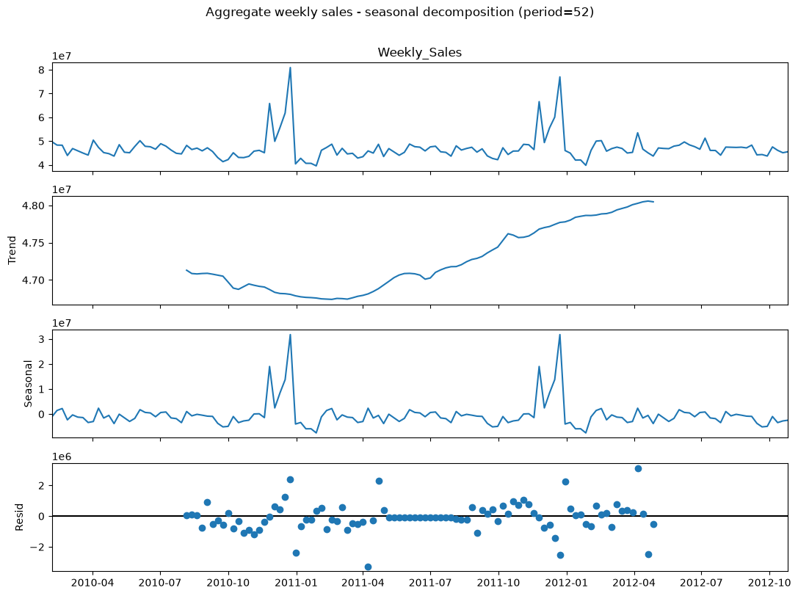

**დეკომპოზიციის ანალიზი**
კომპანიის ჯამური ყოველკვირეული გაყიდვების კლასიკური დეკომპოზიცია (პერიოდით $52$) ზუსტად ასახავს ამოცანის სტრუქტურას: სეზონური კომპონენტი აშკარად დომინირებს — მადლიერების დღისა და შობის ორმაგი პიკი $\approx 3 \times 10^7$-ს აღწევს, მაშინ როდესაც გრძელვადიანი ტრენდი მხოლოდ $4.67 - 4.80 \times 10^7$ დიაპაზონში ნელა იზრდება. ეს ნიშნავს, რომ მოცემულ მონაცემებში **სეზონურობის ეფექტი ბევრად აღემატება ტრენდს** ($\text{სეზონურობა} \gg \text{ტრენდი}$). სწორედ ამიტომ მუშაობს 52-კვირიანი ლაგის (lag-52) ანკერი ასე კარგად და სწორედ ამიტომაა მიდგომა „შარშანდელის მსგავსად იქნება“ საკმაოდ ძლიერი საბაზისო პროგნოზი.

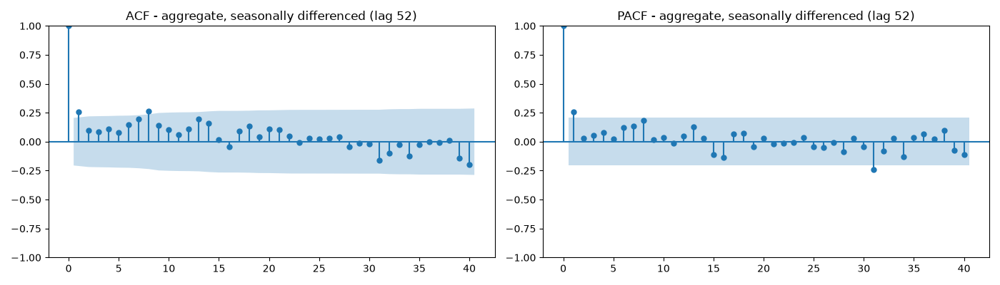

**ACF/PACF ანალიზი**
სეზონური დიფერენცირების (lag 52) შემდეგ, ორივე კორელოგრამა თითქმის მთლიანად ნდობის ინტერვალის ზოლში ექცევა — მხოლოდ პირველ ლაგზე (lag-1) შეინიშნება გამოკვეთილი პიკი ($\approx 0.26$). აქედან გამომდინარეობს დასკვნა: სეზონურობის მოხსნის შემდეგ დროით მწკრივში რჩება სუსტი, დაბალი რიგის ავტოკორელაცია, ანუ სრულიად საკმარისია მცირე რიგის $(p, q)$ პარამეტრების გამოყენება და უფრო რთული არქიტექტურა შედეგს ვერ გააუმჯობესებდა. ეს მოსაზრება ზუსტად დაადასტურა `auto_arima`-მ, რომელმაც ჯამურ მწკრივზე მუშაობისას ავტომატურად **SARIMA(0,1,1)(0,1,1,52)** მოდელი აირჩია.

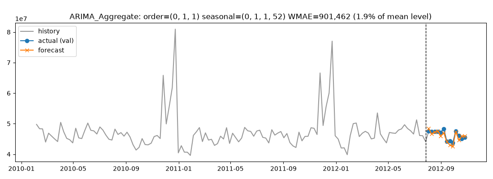

**პროგნოზის ანალიზი**
SARIMA(0,1,1)(0,1,1,52) მოდელი ჯამურ მწკრივზე holdout-ის კვირებს $901,462$-ის ტოლი $WMAE$ მეტრიკით პროგნოზირებს, რაც საშუალო გაყიდვების დონის მხოლოდ **1.9%-ს** შეადგენს — სავალიდაციო მრუდი (ნარინჯისფერი) რეალურ მონაცემებს (ლურჯი) მჭიდროდ მიჰყვება. თუმცა, გასათვალისწინებელია, რომ ეს არის შედარებით „მარტივი“ პერიოდი (აგვისტო-ოქტომბერი, სადღესასწაულო დღეების გარეშე), ხოლო მთავარი სირთულე სადღესასწაულო პიკების ზუსტ მოდელირებაში მდგომარეობს.

**სრული დაფარვის არქიტექტურა (`src/arima_forecaster.py`)**
დაახლოებით 2,900 დამოუკიდებელ (Store, Dept) დროით მწკრივზე სრული SARIMA($m=52$) მოდელის მორგება (fit) გამოთვლითი დროის თვალსაზრისით შეუძლებელია. ამის გამო, `ArimaForecaster` ამოცანას ორ ეტაპად ყოფს:
1. **დაგლუვებული სეზონურ-ნაივური ანკერი:** $y_{t-52}$-ის გარშემო 3 კვირის საშუალო მაჩვენებელი (ფანჯრის ზომა ემპირიულად შეირჩა ბენჩმარკინგის საფუძველზე), რომელიც სეზონურობას აფიქსირებს.
2. **ნაშთის მოდელირება:** დარჩენილ, დესეზონირებულ ნაშთზე (residual) ყენდება მცირე არასეზონური `pmdarima.auto_arima` მოდელი. 

დაახლოებით 2,900 მოდელის სწავლება გაპარალელებულია პროცესორის ბირთვებზე (პროცესი სრულდება $\approx 9-10$ წუთში 8 ბირთვის გამოყენებით).

**პროგნოზების ქცევა (`submissions/arima_submission.csv`)**
დაფიქსირდა 0 უარყოფითი პროგნოზი (მნიშვნელობები 0-ზეა ჩამოჭრილი, საიდანაც 1,626 ზუსტად ნულის ტოლია), ხოლო მაქსიმალური მაჩვენებელი $304,958$-ია, რაც ხის მოდელებთან შედარებით საკმაოდ კონსერვატიულია. სადღესასწაულო პერიოდზე რეაგირება საუკეთესო მოდელებს შორის აქ ყველაზე სუსტი აღმოჩნდა: მადლიერების დღის (Thanksgiving) კვირაში პროგნოზი $18,452$-ია (რაც წინა კვირის $18,491$-ზე ოდნავ დაბალიც კია), ხოლო 51-ე კვირისა და საშობაო კვირის თანაფარდობა მხოლოდ $1.08$-ს შეადგენს. ეს იმაზე მიუთითებს, რომ **3-კვირიანი დაგლუვების ფანჯარა რეალურ პიკებს „აზელს“**. ეს არის ფასი, რომელსაც ანკერის სტაბილურობის სანაცვლოდ ვიხდით. მიუხედავად ამისა, ARIMA LightGBM-ს მხოლოდ $\approx 2.3 - 2.4\%$-ით ჩამორჩა **ყოველგვარი წინასწარი feature engineering-ის გარეშე**, რაც მყარი არგუმენტია იმისა, თუ რამდენად დიდწილად არის ეს ამოცანა სეზონურობის სწორ აღქმაზე დამოკიდებული.

### 4.4 Prophet — საუკეთესო მოდელი

**Kaggle რეიტინგი:** Public: 2755.07 / Private: 2830.03 — საუკეთესო შედეგი ყველა მოდელს შორის | **MLflow ექსპერიმენტი:** `Prophet_Training`

**ექსპერიმენტების ეტაპები (გაშვებების მიხედვით):**
`Prophet_FeatureSelection_Baseline` / `Prophet_FeatureSelection_Regressors` (დამატებითი რეგრესორების ეფექტიანობის შემოწმება), `Prophet_Aggregate` (ჯამური დროითი მწკრივი), `Prophet_CV_Fold0/1/2` (საერთო სავალიდაციო სპლიტერის 3 Fold-ი), `Prophet_Series_{2,14,20}_92` (რეპრეზენტატიული მწკრივები), `Prophet_PanelConfig_*` (4 სხვადასხვა კონფიგურაციის შედარება: `flat_additive_xmasdays`, `linear_damped_xmasdays`, `flat_additive_xmasdummies`, `flat_multiplicative_xmasdays`), `Prophet_Panel_TestLikeValidation`, `Prophet_Panel_HoldoutValidation` და `Prophet_Final`.

მოდელი აგებულია per-(Store, Dept) პანელის პრინციპით: იგი მოიცავს დაახლოებით 3,300 დამოუკიდებელ Prophet მოდელს (`src/prophet_forecaster.py`-ის ბაზაზე), რომლებიც აღჭურვილია სპეციალური სადღესასწაულო კალენდრითა და შობის დღესასწაულამდე არსებული მანძილის (დისტანციის) რეგრესორით.

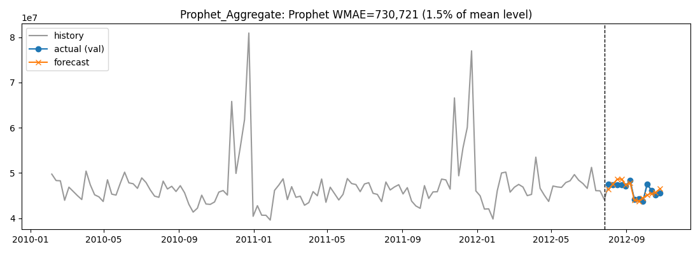

**ანალიზი**
იმავე holdout-პერიოდზე, სადაც SARIMA მოდელმა $901,462$-ის ტოლი $WMAE$ აჩვენა, Prophet-მა მიაღწია **730,721-ს (საშუალო გაყიდვების დონის 1.5%)**. აგრეგირებულ დონეზევე აშკარად გამოიკვეთა, რომ Prophet-ის დეკომპოზიციის ალგორითმი ამ მონაცემების სტრუქტურას ბევრად უკეთ ერგება.

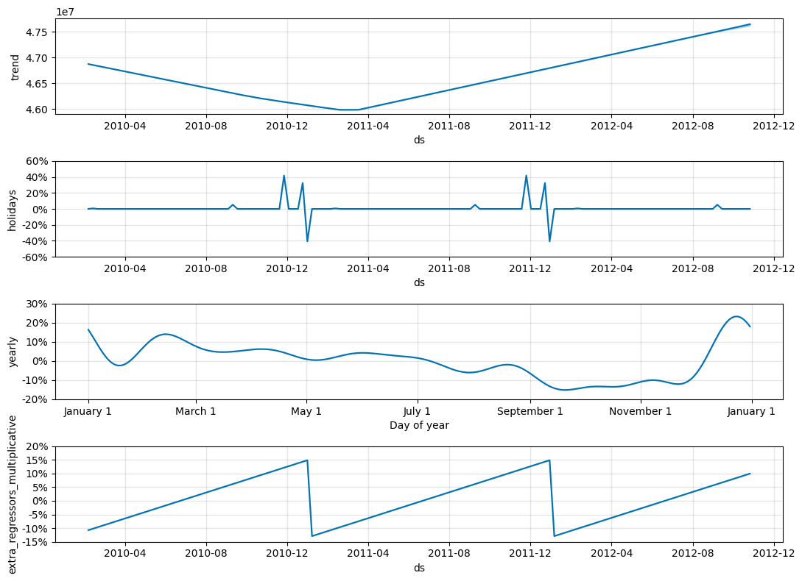

**კომპონენტების ანალიზი**
ეს გრაფიკი ზუსტად ხსნის, თუ *რატომ* აჩვენებს Prophet-ი ასეთ მაღალ ეფექტიანობას მოცემულ ამოცანაში:
1. `holidays` კომპონენტი მადლიერების დღეზე (Thanksgiving) აფიქსირებს მკვეთრ, **+40%-იან** ზრდას (პიკს), ხოლო შობის შემდგომ პერიოდში — **-40%-იან** ვარდნას. ეს არის ზუსტად ის ასიმეტრიული სტრუქტურა, რომელსაც $WMAE$ მეტრიკა 5-მაგი წონით აფასებს.
2. წლიური სეზონურობა დეკემბრის ბოლოს პიკს აღწევს და გაყიდვებს +20–23%-ით ზრდის.
3. მულტიპლიკაციური დამატებითი რეგრესორების (`extra_regressors_multiplicative`) პანელი ასახავს ჩვენ მიერ შემოღებულ შობის დისტანციის რეგრესორს. მისი ხერხისებრი დინამიკა უზრუნველყოფს შობის მოახლოებასთან ერთად ეფექტის ეტაპობრივ ზრდას, რაც იდეალურად აფართოებს და ავსებს `IsHoliday` ბინარული ინდიკატორის შეზღუდულ სიგნალს. 

მოდელი ამ სამი კომპონენტის კომბინაციით ექსპლიციტურად (გამოკვეთილად) აღწერს სადღესასწაულო დინამიკას, ნაცვლად ხეებზე დაფუძნებული მოდელების იმპლიციტური (ირიბი) განშტოებებისა.

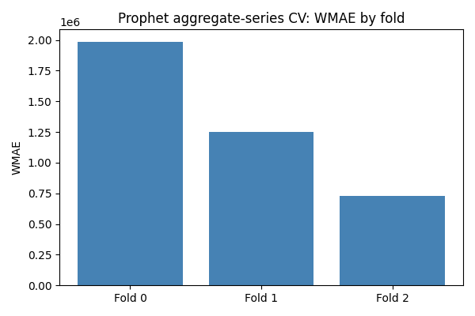

**კროს-ვალიდაციის (CV) ანალიზი**
$WMAE$ მაჩვენებელი Fold-იდან Fold-ში მკვეთრად მცირდება ($\approx 1.99\text{M} \rightarrow 1.25\text{M} \rightarrow 0.73\text{M}$). რაც უფრო მეტ ისტორიულ მონაცემს იღებს მოდელი და რაც უფრო „სტაბილურ“ პერიოდზე ხდება მისი ვალიდაცია, მით უფრო უმჯობესდება შედეგი. ეს დინამიკა კიდევ ერთხელ უსვამს ხაზს სტანდარტული კროს-ვალიდაციის სისუსტეს მოცემულ ამოცანაში, ვინაიდან ცალკეული Fold-ები სადღესასწაულო კვირებს სრულფასოვნად ვერ ფარავენ.

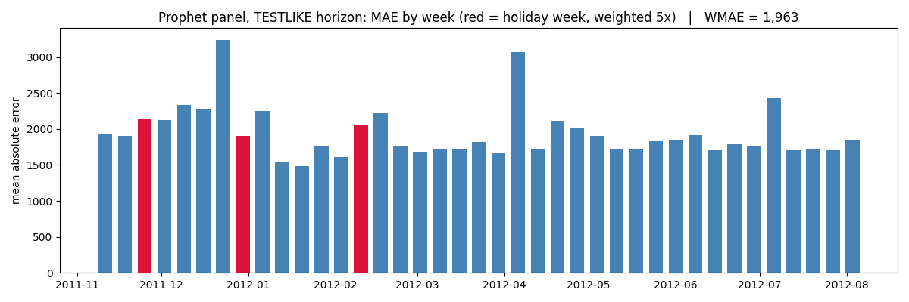

**TESTLIKE ვალიდაცია — ამ მოდელის მთავარი მეთოდოლოგიური გაკვეთილი**
წინა რევიზიის დროს, სტანდარტულ holdout fold-ზე მოდელმა დააფიქსირა 2,901 $WMAE$, თუმცა Kaggle-ზე ქულა 4,680-მდე გაუარესდა. Holdout მიდგომა მოდელის ხარისხს ზედმეტად ოპტიმისტურად აფასებდა, რადგან იგი ზომავდა ტრენინგის ბოლოსთან არსებულ მოკლე პერიოდს. ამ ხარვეზის აღმოსაფხვრელად შეიქმნა სპეციალური **„TESTLIKE“ fold-ი**, რომელიც სრულად იმეორებს რეალური სატესტო ნაკრების სტრუქტურას: 39-კვირიანი ჰორიზონტი, რომელიც ერთი წლით უკან არის გადაწეული და მოიცავს მადლიერების დღესა და შობას. 

ამ სპეციფიკურ fold-ზე მიღებული ქულა ($WMAE$: 1,963) უკვე ზუსტად ასახავდა რეალურ ქცევას Kaggle-ზე, და ოპტიმალური კონფიგურაციების შერჩევაც (`Prophet_PanelConfig_*`) სწორედ მასზე დაყრდნობით განხორციელდა. გრაფიკიდან ჩანს, რომ სადღესასწაულო კვირებში (აღნიშნულია წითლად) შეცდომა საშუალო მაჩვენებელზე მაღალი არ არის. ყველაზე დიდი ცდომილებები ფიქსირდება შობის წინა კვირას ($\approx 3,250$) და აპრილის დასაწყისში ($\approx 3,070$ — სააღდგომო ეფექტი, რომელიც მოდელში ექსპლიციტურად არ არის გათვალისწინებული). შესაბამისად, 5-მაგი წონის მქონე კრიტიკული კვირები კონტროლს ექვემდებარება, რაც საბოლოო დაბალ $WMAE$ ქულას განაპირობებს.

**პროგნოზების ქცევა (`submissions/prophet_submission.csv`)**
მოდელმა აჩვენა 0 უარყოფითი პროგნოზი (2,736 მნიშვნელობა ნულზე ჩამოიჭრა), ხოლო მაქსიმალურმა მაჩვენებელმა $652,215$ შეადგინა — ეს არის ყველაზე გამოკვეთილი და თამამი პიკები ყველა სხვა მოდელთან შედარებით. სადღესასწაულო და ჩვეულებრივი კვირების თანაფარდობა ტოლია **1.179-ის, რაც უმაღლესი მაჩვენებელია** (მადლიერების დღე: 22,248; 51-ე კვირა: 26,658). ეს დინამიკა იდეალურად ერგება 5-მაგი წონის მქონე მეტრიკას. სწორედ ეს არის Prophet-ის მთავარი განმასხვავებელი უპირატესობა: იგი ერთადერთი მოდელია, რომელიც სადღესასწაულო ამპლიტუდას სრულად და ზუსტად საჭირო კვირაში აღადგენს.

### 4.5 N-BEATS

**Kaggle რეიტინგი:** Public: 4289.38 / Private: 4524.03 | **MLflow ექსპერიმენტი:** `NBEATS_Training` (გაშვებები: `NBEATS_Feature_Selection`, `NBEATS_CV` და `NBEATS_Final`)

მოდელი წარმოადგენს გლობალურ არქიტექტურას Darts-ის პანელის ბაზაზე ($\approx 3,331$ დროითი მწკრივი). მუშაობის პროცესში გამოვლინდა და გასწორდა ორი სერიოზული სისტემური ხარვეზი:

1. **მასშტაბირების (`Scaler`) პოზიციური გადაცდენა:** Darts ბიბლიოთეკის `Scaler` per-series ტრანსფორმერებს შემავალი სიის *პოზიციების* მიხედვით აკავშირებს. თავდაპირველად `fit_transform` პროცედურა სრულ სიაზე გაეშვა, ხოლო უკუტრანსფორმაცია (`inverse_transform`) — სიგრძის მიხედვით გაფილტრულ ქვესიმრავლეზე. შედეგად, პროგნოზების $\approx 99\%$ აღდგა *მეზობელი მწკრივის* საშუალო (`mean`) და მასშტაბის (`scale`) პარამეტრებით. Kaggle-ზე ამ ხარვეზმა კატასტროფული ქულები მოგვცა (27,815 / 27,208), თუმცა კროს-ვალიდაციის (CV) ეტაპზე ეს შეცდომა შეუმჩნეველი დარჩა. პრობლემა გადაიჭრა მონაცემების ფილტრაციით უშუალოდ fit/transform/inverse ეტაპებამდე, ყველგან ერთი და იმავე პრინციპით, რამაც ქულა 5,726.84 / 6,127.51-მდე გააუმჯობესა.
2. **სისწრაფის გამო შეკვეცილი არქიტექტურა:** პარამეტრი `num_stacks=10` (Darts-ის ნაგულისხმევი 30-ის ნაცვლად) სუსტ შედეგს აჩვენებდა და მარტივ `lag-52 seasonal-naive` საბაზისო მოდელსაც კი ჩამორჩებოდა. ნაგულისხმევი გამოთვლითი სიმძლავრისა და ეპოქების აღდგენით, ასევე უარყოფითი პროგნოზების ჩამოჭრით, მიღწეულ იქნა საბოლოო შედეგი — **4,289.38 / 4,524.03**.

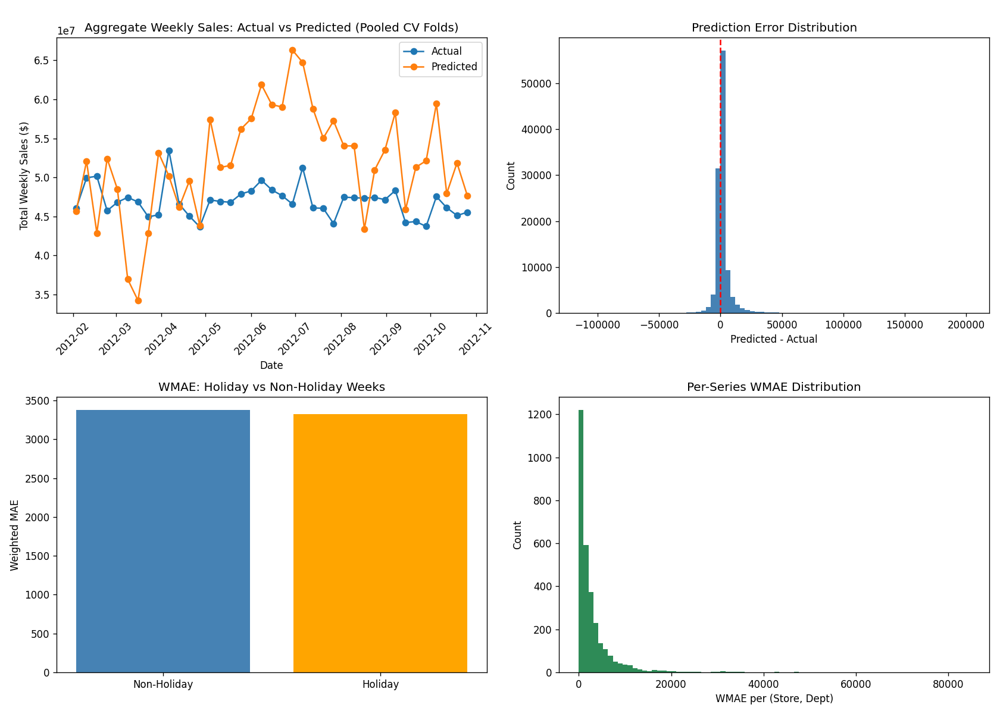

**გრაფიკის ანალიზი**
დიაგნოსტიკის ოთხივე პანელი ერთსა და იმავე კანონზომიერებაზე მიუთითებს:
1. აგრეგირებული რეალური და საპროგნოზო მაჩვენებლების შედარება (`Actual vs Predicted - pooled CV`) ავლენს **სისტემურ გადაჭარბებას** 2012 წლის შუა პერიოდში — პროგნოზი $6.6 \times 10^7$-მდე იზრდება, მაშინ როდესაც რეალური მონაცემები $\approx 4.7 \times 10^7$ ნიშნულზე ფიქსირდება. მოდელი აგრეგატის დონეზე ხასიათდება მაღალი სისტემური მიკერძოებით (over-prediction bias).
2. შეცდომების ჰისტოგრამა კონცენტრირებულია 0-ის გარშემო, თუმცა გამოირჩევა გრძელი ასიმეტრიული კუდებით.
3. სადღესასწაულო და ჩვეულებრივი კვირების $WMAE$ მეტრიკა თითქმის თანაბარია ($\approx 3,320$ vs $\approx 3,370$). ერთი შეხედვით ეს დადებითი მაჩვენებელია, თუმცა რეალურად იმაზე მიუთითებს, რომ მოდელი სადღესასწაულო დღეებს *ვერც კარგად და ვერც ცუდად* ვერ აფასებს — იგი მათ უბრალოდ ვერ აღიქვამს.
4. Per-series $WMAE$ განაწილება ძლიერ მარჯვნივაა გადახრილი, რაც ნიშნავს, რომ საერთო შეცდომის ძირითად წილს რამდენიმე მსხვილი დროითი მწკრივი აგენერირებს.

**პროგნოზების ქცევა (`submissions/nbeats_submission.csv`)**
სადღესასწაულო და ჩვეულებრივი კვირების გაყიდვების თანაფარდობა მხოლოდ **1.036**-ს შეადგენს და, რაც კიდევ უფრო მნიშვნელოვანია, არეულია პიკის დაფიქსირების *დრო*: მადლიერების დღის (Thanksgiving) კვირაში პროგნოზი $17,589$-ია, ხოლო მის მომდევნო კვირას — $18,930$, ანუ პიკი დაგვიანებით ვლინდება. 

ეს არის **მხოლოდ წარსულ კოვარიატებზე დაფუძნებული არქიტექტურის (past-covariates-only) პირდაპირი შედეგი**: N-BEATS მოდელს არ აქვს წვდომა მომავალი დღესასწაულების ზუსტ თარიღებზე, იგი ცდილობს მათ გამოცნობას ექსკლუზიურად წარსული დაკვირვებების ფანჯრიდან, რის გამოც 39-კვირიან საპროგნოზო ჰორიზონტზე ფაზური გადაცდენა (Phase shift) ემართება. ეს წარმოადგენს არა კოდის იმპლემენტაციის ხარვეზს, არამედ თავად არქიტექტურის ფუნდამენტურ შეზღუდვას და არის მთავარი მიზეზი, რის გამოც N-BEATS საგრძნობლად ჩამორჩება ხეებზე დაფუძნებულ ალგორითმებს.

### 4.6 TFT (Temporal Fusion Transformer)

**Kaggle რეიტინგი:** Public: 3615.58 / Private: 3779.46 | **MLflow ექსპერიმენტი:** `TFT_Training`

**ექსპერიმენტების ეტაპები (გაშვებების მიხედვით):**
`TFT_Feature_Selection`, `TFT_HP_Baseline` / `TFT_HP_Wide` / `TFT_HP_Deep` (არქიტექტურის 3 სხვადასხვა ვარიანტი), `TFT_CV_Fold0` (მაღალი გამოთვლითი ღირებულების გამო, 3-ის ნაცვლად გაეშვა მხოლოდ 1 Fold-ი) და `TFT_Final`. TFT მოდელსაც ახასიათებდა ზუსტად იმავე კლასის Darts `Scaler` პოზიციური გადაცდენის ხარვეზი, რომელიც N-BEATS-ის გამოცდილებაზე დაყრდნობით ოპერატიულად გასწორდა.

TFT არის ერთადერთი ღრმა სწავლების (DL) მოდელი მოცემულ პროექტში, რომელიც აქტიურად იყენებს **მომავლის კოვარიატებს (future covariates)** — ცვლადები `days_to_thanksgiving`, `days_to_christmas`, `week_of_year` და `IsHoliday` წინასწარ ცნობილია მომავალი ჰორიზონტისთვის და პირდაპირ მიეწოდება დეკოდერს. ამ არქიტექტურულმა უპირატესობამ პირდაპირი ასახვა პოვა შედეგებში: TFT-მ N-BEATS-თან შედარებით $\approx 16\%$-ით უკეთესი მაჩვენებელი აჩვენა.

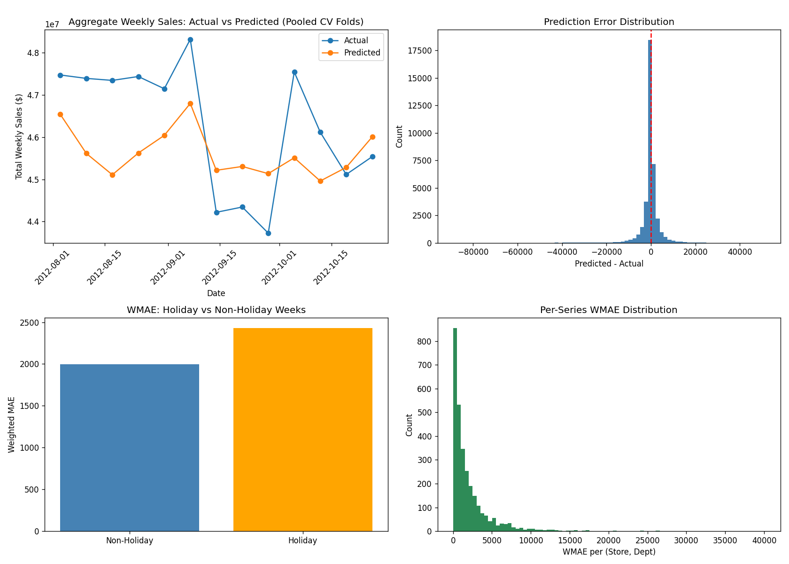

**დიაგნოსტიკის ანალიზი**
აგრიგირებულ დონეზე TFT ზუსტად აფიქსირებს მოძრაობის საერთო მიმართულებას (ტრენდს), თუმცა მნიშვნელოვნად აგლუვებს ამპლიტუდას — რეალური რყევები (ლურჯი მრუდი) საპროგნოზო მაჩვენებლებთან (ნარინჯისფერი მრუდი) შედარებით ბევრად უფრო მკვეთრია. სადღესასწაულო პერიოდის შეცდომა ($WMAE \approx 2,430$) აქ უკვე აშკარად აღემატება ჩვეულებრივი კვირების მაჩვენებელს ($WMAE \approx 1,990$). ეს ნიშნავს, რომ N-BEATS-ისგან განსხვავებით, მოცემული მოდელი „ხედავს“ დღესასწაულებს და ცდილობს მათ ადაპტირებას, თუმცა რეალურ ამპლიტუდას ბოლომდე მაინც ვერ აფიქსირებს.

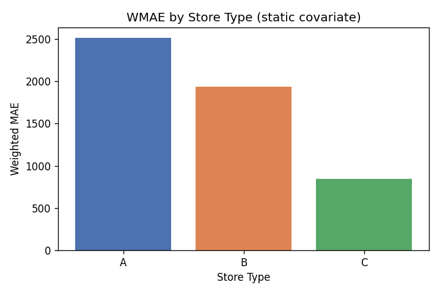

**მაღაზიების ტიპების ანალიზი**
ცდომილება პირდაპირპროპორციულად იზრდება მაღაზიის მასშტაბებთან ერთად (Type A: $\approx 2,510 > \text{Type B}: \approx 1,930 > \text{Type C}: \approx 840$). ეს სრულიად მოსალოდნელი კანონზომიერებაა, რადგან A ტიპის ობიექტებს აბსოლუტურ მნიშვნელობებში გაცილებით დიდი გაყიდვები და მაღალი საპიკე მაჩვენებლები ახასიათებთ. სტატიკური კოვარიატების მნიშვნელოვნების რეიტინგშიც (იხ. ქვემოთ) დომინირებს ცვლადი `Size` — მოდელი მასშტაბების დიფერენციაციას სწორედ ამ კომპონენტზე დაყრდნობით ახორციელებს.

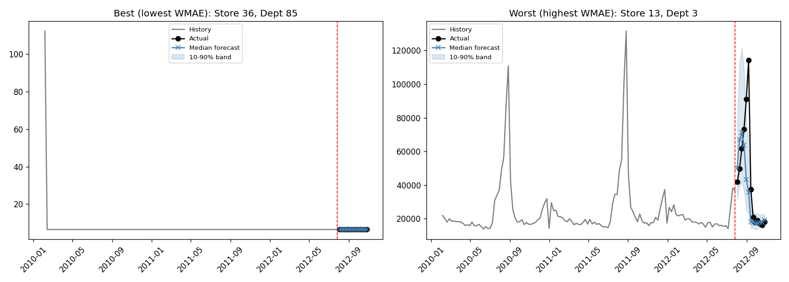

**რეპრეზენტატიული პროგნოზების ანალიზი**
საუკეთესო შედეგი (Store 43, Dept 85) დაფიქსირდა თითქმის ნულოვან, სტატიკურ დროით მწკრივებზე — ბრტყელი გრაფიკების პროგნოზირებას ყველა მოდელი თანაბრად წარმატებით ახერხებს. ყველაზე დაბალი სიზუსტე (Store 13, Dept 3) შეინიშნება სეზონურ, სკოლის დაწყების პერიოდის (back-to-school) პიკზე $\approx 125\text{K}$-მდე: მოდელი ხედავს მოახლოებულ პიკს, თუმცა ვერ აღწევს საჭირო ამპლიტუდას და აგვიანებს მაქსიმუმის დაფიქსირებას, რის გამოც 10-90% საპროგნოზო ინტერვალი უკიდურესად ფართოვდება. ეს არის ტიპური სურათი — მთლიანი შეცდომის ($WMAE$) ძირითადი წილი სწორედ რამდენიმე ასეთ მაღალამპლიტუდიან მწკრივზე მოდის.

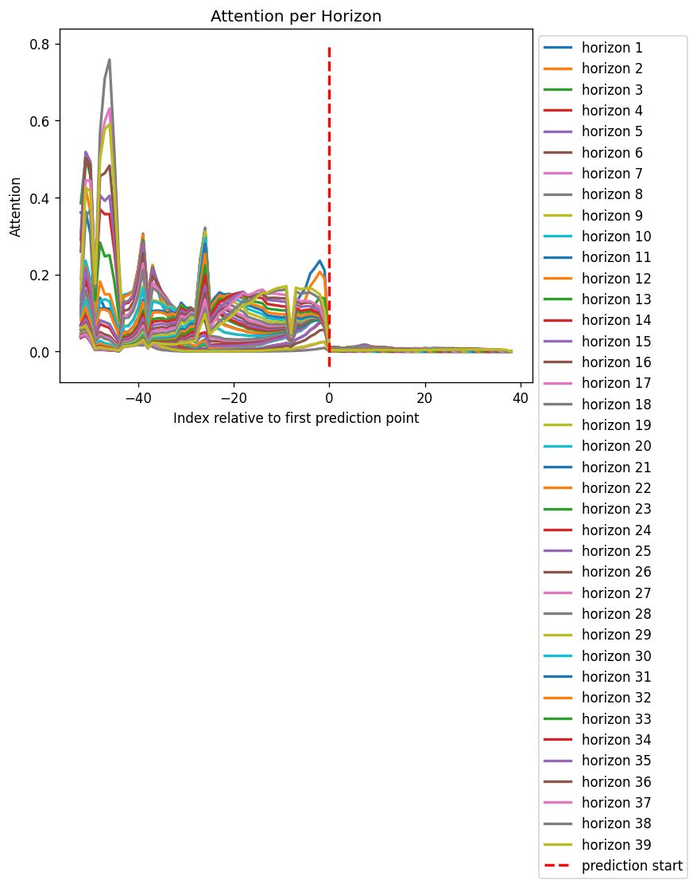

**ყურადღების მექანიზმის (Attention) ანალიზი**
ყურადღების წონები (attention weights) მკვეთრადაა კონცენტრირებული ენკოდერის ფანჯრის საწყის ეტაპზე — **დაახლოებით -52 კვირაზე, ანუ ზუსტად ერთი წლის წინანდელ ისტორიულ მონაცემზე** (პიკური მნიშვნელობებით $\approx 0.6 - 0.76$), ხოლო მეორადი პიკები ფიქსირდება $\approx -40$ და $\approx -26$ კვირების ინტერვალებში. ტრანსფორმერმა დამოუკიდებლად, ავტონომიურ რეჟიმში აღმოაჩინა ის მნიშვნელოვანი ფაქტორი, რასაც ხის მოდელებში ხელით ვაწვდიდით `sales_lag_52`-ის სახით — წლიური სეზონურობა ამ ამოცანის უმთავრესი სიგნალია. ეს არის მოდელის ინტერპრეტირებადობის (interpretability) ბრწყინვალე დემონსტრაცია და ჩვენ მიერ ჩატარებული feature engineering-ის დამოუკიდებელი ვალიდაცია.

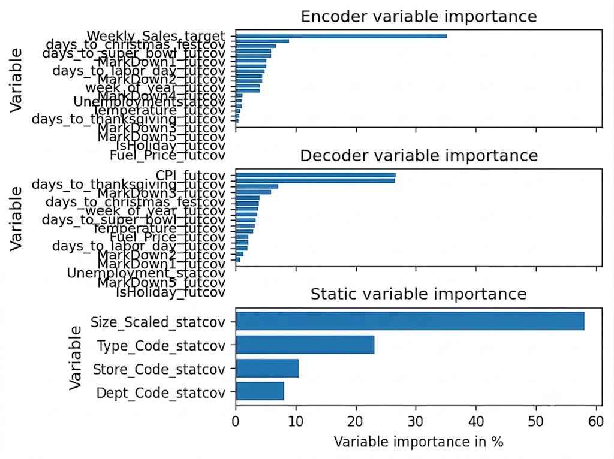

**ცვლადების მნიშვნელოვნების ანალიზი**
ენკოდერის ნაწილში აშკარად ლიდერობს `Weekly_Sales_target` ($\approx 35\%$) — ანუ თავად დროითი მწკრივის ისტორია. დეკოდერში კი წამყვან პოზიციებს იკავებს `CPI_futcov` ($\approx 27\%$) და `days_to_thanksgiving_futcov`. ეს ადასტურებს, რომ მომავლის პროგნოზირებისას მოდელი რეალურად ეყრდნობა სადღესასწაულო დღეებამდე არსებულ დისტანციებს, რაც სწორედ მომავლის კოვარიატების (future covariates) დამატების ძირითად მიზანს წარმოადგენდა. სტატიკურ ცვლადებს შორის მოლოდინებისამებრ დომინირებს `Size_Scaled` ($\approx 58\%$) და `Type_Code` ($\approx 23\%$), რაც მოდელს მასშტაბის შესახებ აწვდის ინფორმაციას.

**პროგნოზების ქცევა (`submissions/tft_submission.csv`):**
მოდელმა დააფიქსირა 771 უარყოფითი პროგნოზი (0.67%, მინიმალური მნიშვნელობით -4,311). 51-ე კვირის საპროგნოზო პიკი საკმაოდ მკვეთრი და ძლიერია ($26,167$ — თანაფარდობა მონიშნულ საშობაო კვირასთან შეადგენს 1.55-ს, რაც ხის მოდელების დონეზეა), ხოლო მადლიერების დღის (Thanksgiving) მაჩვენებელი ზომიერია ($20,624$). მომავლის კოვარიატების ინტეგრაციამ სრულად გაასწორა პიკის *ქრონოლოგიური მდებარეობა* (N-BEATS-ის დაგვიანებული ფაზის საპირისპიროდ), თუმცა საერთო სიზუსტის მეტრიკით TFT მაინც ჩამორჩა ხეებზე დაფუძნებულ ალგორითმებს. სავარაუდო მიზეზი არის ის, რომ არსებული მონაცემთა ბაზა ($\approx 140$ კვირის ისტორია) არ აღმოჩნდა საკმარისი ტრანსფორმერული არქიტექტურის სრული პოტენციალის რეალიზებისთვის.

### 4.7 DLinear

**Kaggle რეიტინგი:** Public: 3098.06 / Private: 3260.01 | **MLflow ექსპერიმენტი:** `DLinear_Training` (გაშვებები: `DLinear_Feature_Selection`, `DLinear_CV` და `DLinear_Final`)

DLinear არის დეკომპოზიციაზე დაფუძნებული წრფივი მოდელი (რომელიც ტრენდისა და სეზონურობის კომპონენტებს ორი დამოუკიდებელი წრფივი შრით ამუშავებს) და აგებულია Darts-ის გლობალური პანელის ბაზაზე. მისი მთავარი უპირატესობა არქიტექტურული სისადავეა — LTSF-Linear ლიტერატურის თანახმად, იგი გრძელვადიანი პროგნოზირების ამოცანებში ხშირად ჯაბნის ბევრად უფრო რთულ ტრანსფორმერულ მოდელებს.

**რედიზაინის ისტორია — ამ მოდელის მთავარი გაკვეთილი:**
ნედლ გაყიდვებზე გაწვრთნილმა პირველმა ვერსიამ აჩვენა კროს-ვალიდაციის $WMAE: 4735$ და Kaggle რეიტინგი: $4816$, რაც პროექტის ფარგლებში ყველაზე სუსტი შედეგი იყო. შედარებისთვის, მხოლოდ საბაზისო სეზონური ანკერიც კი (`src/seasonal_anchor.py` — იგივე დაგლუვებული lag-52 მაჩვენებელი, რომელსაც ARIMA იყენებს) $3,104$-იან ქულას აფიქსირებს. წრფივი მოდელი 39-კვირიან ჰორიზონტზე ნედლი დროითი მწკრივის მკვეთრ სეზონურ პიკებს ვერ სწვდებოდა. 

ამის გამო, მოდელი მთლიანად გადამუშავდა ARIMA-ს არქიტექტურის ანალოგიით: **ანკერი აფიქსირებს ძირითად სეზონურობას, ხოლო DLinear სწავლობს მხოლოდ დესეზონირებულ ნაშთს (residual)**. შედეგად, Kaggle-ის ქულა 4816-დან **3098.06**-მდე გაუმჯობესდა — მხოლოდ ამოცანის სწორად ფორმულირებითა და მათემატიკური რედიზაინით, ყოველგვარი არქიტექტურული გართულების გარეშე, მოდელის შეცდომა 36%-ით შემცირდა.

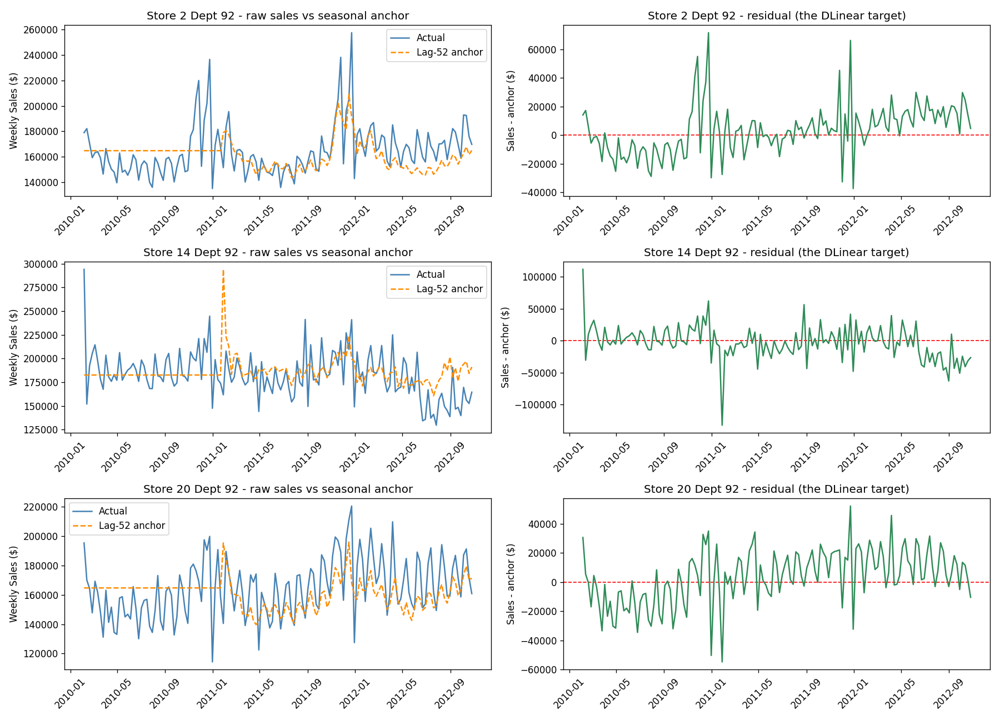

**დიზაინის ანალიზი**
გრაფიკის მარცხენა სვეტი ზუსტად ასახავს ანკერის ფუნქციას: 52-კვირიანი დაგლუვებული ანკერი (ნარინჯისფერი წყვეტილი მრუდი) რეალურ გაყიდვებს (ლურჯი მრუდი) წლიური სტრუქტურის მიხედვით მიჰყვება. მარჯვენა სვეტი კი გვიჩვენებს DLinear-ის რეალურ სამიზნე ცვლადს — ნაშთს ($\text{Sales} - \text{Anchor}$), რომელიც 0-ის გარშემო მერყეობს და მასშტაბით ბევრად მცირეა, ვიდრე თავად რეალური გაყიდვები. 

აქ კარგად ჩანს ისიც, თუ რა რჩება ნაშთის სახით: Store 14-ის პანელზე 2011 წლის იანვარში ანკერის მიერ დაშვებული ცრუ პიკი (რომელიც წინა წლის ანომალიური კვირიდან გადმოჰყვა) დიდ უარყოფით ნაშთს ტოვებს. ეს მიუთითებს იმაზე, რომ ანკერი იდეალური არ არის და სწორედ ამ ტიპის სისტემური ცდომილებების გასწორება წარმოადგენს DLinear-ის ძირითად ამოცანას.

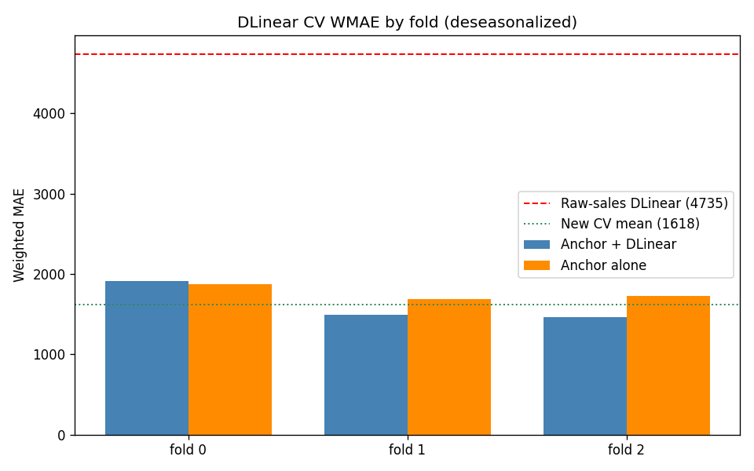

**კროს-ვალიდაციის (CV) ანალიზი**
ეს გრაფიკი პირდაპირ პასუხობს კითხვას — ამატებს თუ არა DLinear რაიმე ღირებულებას საბაზისო ანკერს. ლურჯი მრუდი ($\text{Anchor} + \text{DLinear}$) პირველ და მეორე Fold-ზე აშკარად სჯობნის ნარინჯისფერ მრუდს (მხოლოდ ანკერი), ხოლო ნულოვან Fold-ზე დაახლოებით მისი ტოლია. ახალი კროს-ვალიდაციის საშუალო მაჩვენებელი **1618**-ს შეადგენს, ნედლი გაყიდვების ვერსიის 4735-იანი ნიშნულის (წითელი ხაზი) წინააღმდეგ, რაც თითქმის 3-ჯერ უკეთესი შედეგია. შესაბამისად, ნაშთების მოდელირებაზე გადასვლამ მოდელი „გადაარჩინა“, თავად DLinear კი ანკერს ზომიერ, მაგრამ სტაბილურ და პოზიტიურ დანამატს აძლევს.

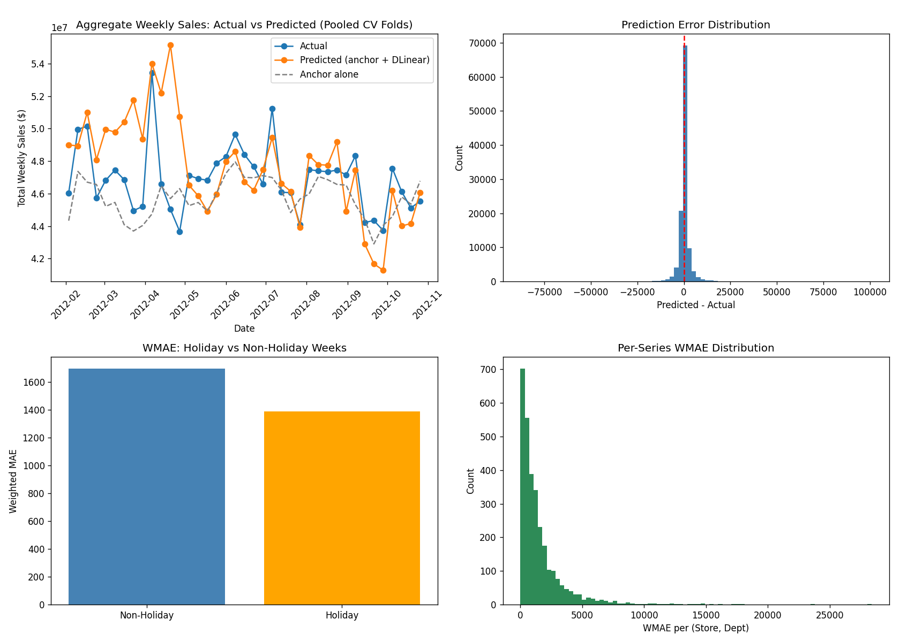

**დიაგნოსტიკის ანალიზი**
1. აგრეგირებულ დონეზე პროგნოზი (ნარინჯისფერი მრუდი) ზუსტად მიჰყვება რეალურ მონაცემებს, თუმცა 2012 წლის აპრილში შეინიშნება აშკარა გადაჭარბება. რუხი წყვეტილი ხაზი (`anchor alone`) აჩვენებს, რომ ამ კონკრეტულ მონაკვეთში ცდომილება ანკერიდან კი არა, უშუალოდ DLinear-ის მიერ შეტანილი კორექტირებიდან მოდის.
2. შეცდომების განაწილება ხასიათდება სიმეტრიული და ვიწრო სტრუქტურით.
3. ყველაზე საგულისხმო მაჩვენებელი: **სადღესასწაულო კვირების შეცდომა ($WMAE \approx 1,390$) უფრო დაბალია, ვიდრე ჩვეულებრივი კვირების ($WMAE \approx 1,700$)**. ანკერისგან მემკვიდრეობით მიღებული სადღესასწაულო სტრუქტურა 5-მაგი წონის მქონე მეტრიკაზე პირდაპირ და ეფექტურად მუშაობს. ეს წარმოადგენს N-BEATS მოდელის ზუსტ საპირისპირო სურათს, სადაც სადღესასწაულო დღეები სპეციფიკური სიზუსტით არ გამოირჩეოდა.

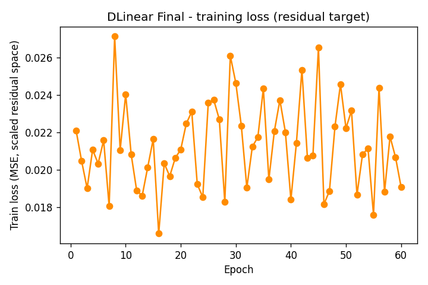

**სწავლის მრუდის (Training Loss) ანალიზი**
60 ეპოქის განმავლობაში შეცდომის ფუნქცია (loss) $0.017 - 0.027$ დიაპაზონში მერყეობს კლების გამოკვეთილი ტენდენციის გარეშე. ეს სრულიად კანონზომიერი სურათია: სეზონური ანკერის გამოკლების შემდეგ დარჩენილი ნაშთი დიდწილად თეთრ ხმაურს წარმოადგენს და DLinear-ისთვის მასში გამოსაყოფი სიგნალის მცირე წილიღა რჩება. ეს ფაქტი სრულ თანხვედრაშია კროს-ვალიდაციის შედეგებთან — მოდელი გვაძლევს ზომიერ, მაგრამ რეალურ გაუმჯობესებას საბაზისო ანკერთან შედარებით.

**პროგნოზების ქცევა (`submissions/dlinear_submission.csv`):**
მოდელმა წარმატებით დააფიქსირა მადლიერების დღის (Thanksgiving) პიკი ($21,017$), ასევე ძლიერია 51-ე კვირის მაჩვენებელიც ($25,593$ — თანაფარდობა მონიშნულ საშობაო კვირასთან შეადგენს 1.52-ს, რაც ხის მოდელების დონეზეა). 

მოდელის სუსტ მხარეებს მიეკუთვნება: 2,338 უარყოფითი პროგნოზი (2.03%) უკიდურესი მინიმალური მნიშვნელობით **-83,656** — ეს არის ყველაზე ექსტრემალური ვარდნა ყველა მოდელს შორის, რადგან ანკერისა და ნაშთის ჯამი ქვედა ზღვრით ჩამოჭრის (clipping) გარეშე დარჩა (რაც მოდელის მარტივი გაუმჯობესების აშკარა კანდიდატია). ასევე დაფიქსირდა ყველაზე მაღალი საერთო საშუალო მაჩვენებელი ($17,315$) და ყველაზე დაბალი კორელაცია სხვა მოდელებთან ($0.93 - 0.95$).

**შედარება ARIMA-სთან — ერთი და იგივე ანკერი, სხვადასხვა ნაშთის მოდელი:**
ორივე მიდგომა იყენებს ერთსა და იმავე სეზონურ ანკერს და განსხვავდება მხოლოდ ნაშთის მოდელირების მეთოდოლოგიით: ARIMA იყენებს per-series `auto_arima`-ს, ხოლო DLinear — გლობალურ წრფივ ნეირონულ ქსელს. საბოლოო შედეგები პრაქტიკულად იდენტური აღმოჩნდა: Public ლიდერბორდზე DLinear ოდნავ სჯობნის პარტნიორს (3098.06 vs 3104.61), ხოლო Private-ზე მცირედით ჩამორჩება (3260.01 vs 3239.38). 

დასკვნა: **მთავარი საინფორმაციო სიგნალის ლომის წილი მოდის ანკერზე, ხოლო ნაშთისთვის შერჩეული მოდელი მეორეხარისხოვანია**. ეს არის კიდევ ერთი მყარი დასტური იმისა, რომ მოცემულ ამოცანაში საბოლოო წარმატებას სეზონურობის კომპონენტის სწორი დაჭერა და ფორმულირება წყვეტს.

### 4.8 TimesFM (ბონუსი — საბაზისო Foundation მოდელი)

**Kaggle რეიტინგი:** Public: 2976.65 / Private: 3137.01 | **MLflow ექსპერიმენტი:** `TimesFM_Training` (გაშვებები: `TimesFM_ZeroShot`, `TimesFM_Final_HoldoutValidation` და `TimesFM_Final`)

Google-ის მიერ წინასწარ გაწვრთნილი საბაზისო (foundation) მოდელი, რომელიც გამოყენებულია **zero-shot რეჟიმში** — ჩვენს ხელთ არსებულ მონაცემებზე ყოველგვარი დამატებითი სწავლების გარეშე, მხოლოდ მიმდინარე ისტორიული კონტექსტის მიწოდებითა და პროგნოზის გენერირებით (`src/timesfm_forecaster.py`).

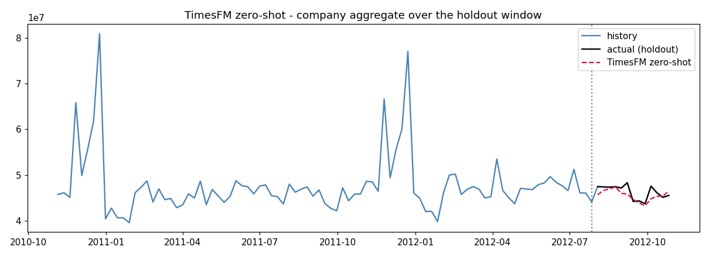

**გრაფიკის ანალიზი**
Holdout სავალიდაციო ფანჯარაზე zero-shot პროგნოზი (წითელი წყვეტილი მრუდი) რეალურ აგრეგირებულ მონაცემებს (შავი მრუდი) საკმაოდ მჭიდროდ მიჰყვება. მოდელი, რომელსაც Walmart-ის სპეციფიკური მონაცემები მანამდე არასდროს უნახავს, მხოლოდ ისტორიული კონტექსტის საფუძველზეც იდეალურად იჭერს გაყიდვების საერთო დონესა და მოკლევადიან დინამიკას.

**პროგნოზების ქცევა (`submissions/timesfm_submission.csv`):**
მოდელმა დააფიქსირა 0 უარყოფითი პროგნოზი და აჩვენა ყველაზე კონსერვატიული საპროგნოზო დიაპაზონი (მაქსიმალური მნიშვნელობით $216,201$, რაც ყველა სხვა მოდელზე დაბალია). სადღესასწაულო კვირების თანაფარდობა შედარებით სუსტია ($1.045$; 51-ე კვირის პიკი მხოლოდ $19,010$-ს შეადგენს, ანუ რეალური საშობაო ამპლიტუდის დიდი ნაწილი დაკარგულია). ეს სრულიად ლოგიკურია, ვინაიდან zero-shot მოდელისთვის Walmart-ის კონკრეტული შიდა სადღესასწაულო კალენდარი და მისი ეფექტები წინასწარ ცნობილი არ არის.

**მთავარი აღმოჩენა:**
ამ შეზღუდვების მიუხედავად, TimesFM-მა **Public ლიდერბორდზე აჯობა როგორც LightGBM-ს (3034.98), ისე ARIMA მოდელს (3104.61)** — ყოველგვარი წინასწარი სწავლებისა (training) და ხელით გაწერილი feature engineering-ის გარეშე. პირსონის კორელაციის კოეფიციენტი ARIMA მოდელთან $\approx 0.99$-ს შეადგენს, რაც იმას ნიშნავს, რომ ქცევითი თვალსაზრისით იგი ძალიან ჰგავს ჩვენს სეზონურ ანკერს, თუმცა მუშაობს მცირედით უფრო ეფექტურად. დროითი მწკრივებისთვის განკუთვნილი თანამედროვე საბაზისო (foundation) მოდელები უკვე წარმოადგენენ სრულად კონკურენტუნარიან და მძლავრ საწყის წერტილს ნებისმიერი ანალიზისთვის — ეს არის მოცემული ბონუს-ექსპერიმენტის უმთავრესი დასკვნა.

---

## 5. ინფერენსის ნოუთბუქი (`model_inference.ipynb`)

ეს ნოუთბუქი პროექტის საბოლოო, შემაჯამებელი ეტაპია: იგი იღებს **სრულიად დაუმუშავებელ** `data/raw/test.csv` ფაილს, ატარებს მას **MLflow Model Registry**-დან ჩამოტვირთულ გამარჯვებულ პაიპლაინში და აგენერირებს `submissions/final_submission.csv` ფაილს Kaggle-ის ფორმატში. ქვემოთ მოცემულია ინფერენსის ნაბიჯების მიმოხილვა და თითოეული არქიტექტურული გადაწყვეტილების დასაბუთება.

### 5.1 რომელი მოდელი გამოიყენება და რატომ

ინფერენსის პროცესი ეყრდნობა **Prophet-ის** მოდელს (`src.prophet_forecaster.ProphetPanelPipeline`) — per-(Store, Dept) პანელს დაახლოებით 3,300 ინდივიდუალური მოდელით, რომელიც აღჭურვილია დეპარტამენტის დონის სეზონური `week-of-year` დამზღვევი მექანიზმით (fallback) იმ მწკრივებისთვის, რომლებიც ზედმეტად მოკლეა სრულფასოვანი სწავლებისთვის (fit).

ნოუთბუქში ღიად არის განხილული ერთი შეუსაბამობა: **საერთო expanding-window კროს-ვალიდაცია (CV) Prophet-ს პირველ ადგილზე არ აყენებს** (ამ შემთხვევაში DLinear-ი აჩვენებს 1,618 ქულას). ეს სრულიად მოსალოდნელი შედეგია — როგორც სექცია 3.3-ში აღვწერეთ, საერთო CV-ის ვერცერთი Fold სტრუქტურულად ვერ შეიცავს მადლიერების დღისა (Thanksgiving) თუ შობის სავალიდაციო კვირებს. რეალური სატესტო ჰორიზონტი კი სწორედ ამ პერიოდებითაა დატვირთული, რომლებსაც `WMAE` მეტრიკა 5-მაგ წონას ანიჭებს. Prophet-ის `TESTLIKE` fold-ი (ტესტის სტრუქტურის 39-კვირიანი რეპლიკა) ზუსტად იმეორებს ლიდერბორდის ქცევას, მაშინ როცა საერთო CV ამას ვერ ახერხებს. შესაბამისად, არჩევანი ლიდერბორდის რეალურ ქულაზე დაყრდნობით გაკეთდა და ეს გადაწყვეტილება ნოუთბუქშივეა არგუმენტირებული.

### 5.2 რატომ სრულდება მთელი ინფერენსი ერთი `.predict()` გამოძახებით

დავალების უმთავრესი მოთხოვნაა, რომ მონაცემთა წინასწარი დამუშავება (preprocessing), ახალი ცვლადების გენერაცია (feature engineering) და უშუალოდ ინფერენსი ერთიან ობიექტში იყოს ინკაფსულირებული. Prophet-ის შემთხვევაში ეს ლოგიკა ბუნებრივად მუშაობს: `ProphetPanelPipeline.predict()` მეთოდი პირდაპირ იღებს **ნედლი `test.csv`-ის ფორმატის მონაცემებს** და აბრუნებს `np.ndarray`-ს. მოდელისთვის საკმარისია მხოლოდ `Store`, `Dept` და `Date` ცვლადების მიწოდება — მას **არ სჭირდება `IsHoliday` სვეტი ან `features.csv`/`stores.csv` ფაილებთან გაერთიანება (merge)**. ეს იმიტომ ხდება, რომ სადღესასწაულო ეფექტები თითოეული ინდივიდუალური Prophet მოდელის შიგნით არსებობს (holidays ფრეიმისა და შობის დღესასწაულამდე მანძილის რეგრესორის სახით, რომლებიც ავტომატურად ითვლება თარიღიდან გამომდინარე). შესაბამისად, კოდში ცალკე გასაშვები ტრანსფორმაციის საფეხურები საერთოდ აღარ რჩება.

### 5.3 ნაბიჯები

1. **ინიციალიზაცია (Colab-თავსებადობა)**
   ეს ეტაპი იდენტურია Prophet-ის საექსპერიმენტო ნოუთბუქის საწყისი უჯრედისა: ხდება რეპოზიტორიის კლონირება/სინქრონიზაცია, `requirements.txt`-ში მოცემული ბიბლიოთეკების დაინსტალირება, სამუშაო დირექტორიის შეცვლა (`chdir`) `notebooks/`-ზე და `data/raw/` მონაცემების გადმოწერა Google Drive-იდან (ვინაიდან კონკურსის მონაცემები `.gitignore`-შია და კლონირებულ რეპოზიტორიაში არასდროს ხვდება). სწორედ ეს უჯრედი უზრუნველყოფს `import src...` ბრძანების გამართულ მუშაობას — Google Colab-ზე ნაგულისხმევი სამუშაო დირექტორია არის `/content` და ამ ნაბიჯის გარეშე იმპორტები `ModuleNotFoundError` შეცდომით ჩაიშლებოდა. კლონის სინქრონიზაციის პროცესი განზრახ არის მკაცრი (`fetch` + `reset --hard` + `clean -fd`), რადგან `submissions/*.csv` ფაილები ტრეკინგშია, ყოველი ახალი გაშვება მათ გადაწერს და ჩვეულებრივი `git pull` აქ ყოველთვის კონფლიქტს გამოიწვევდა.

2. **იმპორტები და ფაილების გზები**
   ფუნქცია `find_repo_root()` მიმდინარე სამუშაო დირექტორიიდან (cwd) იწყებს მაღლა სვლას `src/prophet_forecaster.py` ფაილის პოვნამდე, ნაცვლად იმისა, რომ ბრმად ენდოს დირექტორიის სახელს. ეს მნიშვნელოვანია არა მხოლოდ ჩვენი შიდა იმპორტებისთვის: პაიპლაინი შენახულია (დამწნეხილია) როგორც `src.prophet_forecaster.ProphetPanelPipeline`, რაც იმას ნიშნავს, რომ **ზუსტად მოდულის ეს გზა უნდა იყოს ხელმისაწვდომი**, წინააღმდეგ შემთხვევაში `joblib` ობიექტის აღდგენას (დესერიალიზაციას) ვერ შეძლებს.

3. **ავტორიზაციის მონაცემები (3-საფეხურიანი კასკადი)**
   უსაფრთხოების მიზნით, ავტორიზაციის ტოკენი ნოუთბუქში არასდროს იწერება ღიად. კოდი იყენებს 3-საფეხურიან ლოგიკას: ჯერ მოწმდება უკვე არსებული გარემოს (env) ცვლადები (ვინაიდან VS Code-იდან Colab-ის Runtime-ის მართვისას `google.colab.userdata` ხშირად იბლოკება, ნოუთბუქში ჩაშენებულია `getpass`-ზე დაფუძნებული მექანიკური override უჯრედი), შემდგომ მოწმდება Colab Secrets, ხოლო ბოლოს — ლოკალური `.env` ფაილი. ეს ზუსტად ის კასკადური პრინციპია, რომელიც თითოეულ `model_experiment_*.ipynb` ნოუთბუქში გამოვიყენეთ.

4. **MLflow Tracking Store და რეესტრის კოორდინატები**
   ექსპერიმენტები ილოგება გუნდის საერთო DagsHub სერვერზე. **ლოკალურ `./mlruns` საქაღალდეზე fallback მექანიზმი განზრახ არ არის გათვალისწინებული** — ლოკალურ საცავში გუნდის არცერთი run არ ინახება, შესაბამისად, ასეთი fallback მხოლოდ შეცდომას შენიღბავდა და მოდელს ჩუმად ვერ ვიპოვიდით. აქვე აღსანიშნავია მნიშვნელოვანი დეტალი: MLflow 3.x ვერსიიდან **ტრადიციული ეტაპები (`Staging`/`Production`) ამოღებულია და ჩანაცვლებულია თეგებით (alias)**. აქედან გამომდინარე, `MODEL_ALIAS = "champion"` წარმოადგენს ძველი `Production`-სტატუსის პირდაპირ ალტერნატივას და მოდელი იტვირთება `models:/Best_Model@champion` URI მისამართიდან.

5. **ნედლი ტესტ-მონაცემების ჩატვირთვა**
   მონაცემები იკითხება პირდაპირ დისკიდან, ზუსტად იმ ფორმატში, როგორსაც მათ Kaggle გვაწვდის: `Store, Dept, Date, IsHoliday`. ფუნქცია `src.preprocessing.load_raw_data()` აქ განზრახ **არ** გამოიძახება, რადგან იგი კითხულობს ოთხივე ცხრილს და ავსებს მაკრო-სვეტებს, რაც ინფერენსის ეტაპზე საჭირო არ არის. პრეპროცესინგიდან გადმოტანილია მხოლოდ `test.csv`-ის ფაილისა და დირექტორიის ასიმეტრიის დამუშავების ლოგიკა (`resolve_raw_csv`).

6. **რეესტრის bootstrap (ერთჯერადი)**
   დეტალურად აღწერილია ქვემოთ, 5.4 სექციაში.

7. **მოდელის წამოღება რეესტრიდან (Model Registry)**
   ბრძანება `mlflow.pyfunc.load_model("models:/Best_Model@champion")` უზრუნველყოფს იმას, რომ ჭეშმარიტების ერთადერთ წყაროდ მიიჩნევა ის მოდელი, რომელზეც მოცემული მომენტისთვის მიუთითებს შესაბამისი alias, და არა ფაილი რომელიმე ლოკალურ კომპიუტერზე. ლოკალურ ფაილზე fallback აქაც არ გვაქვს: თუ რეესტრიდან ჩამოტვირთვა ჩავარდა, სწორი გზა რეესტრის გამართვაა და არა `submissions/` საქაღალდეში შემთხვევით აღმოჩენილი ფაილით სქორინგი.

8. **პროგნოზირება (Inference)**
   პროცესი სრულდება ერთიანი ბრძანებით: `pipeline.predict(raw_test)`. CPU-ზე ამას სჭირდება დაახლოებით 3.3 წუთი (~3,000 ინდივიდუალური Prophet მოდელის დესერიალიზაცია JSON ფორმატიდან + პროგნოზირება, რაც `joblib`-ით გაპარალელებულია პროცესორის ბირთვებზე). GPU-ს გამოყენება ამ ეტაპზე ეფექტს არ იძლევა, რადგან Prophet-ი ეყრდნობა Stan-ის პლატფორმას, რომელსაც GPU მხარდაჭერა არ გააჩნია.

9. **ფორმატირება, შემოწმებები და ფაილის ჩაწერა**
   დეტალურად აღწერილია ქვემოთ, 5.5 სექციაში.

### 5.4 რეესტრის ბუთსტრაპი (Registry Bootstrap) — ნოუთბუქის ყველაზე საინტერესო ნაწილი

ამ ეტაპზე წყდება რეალური, პრაქტიკული პრობლემა. `model_experiment_prophet.ipynb` ნოუთბუქი გამარჯვებულ პაიპლაინს ინახავს კომბინაციით: `joblib.dump()` + `mlflow.log_artifact()`. ეს ნიშნავს, რომ `Prophet_Final` გაშვებას (run) მიბმული აქვს **უბრალო ფაილი**. უბრალო ფაილი კი, MLflow-ს არქიტექტურით, **მოდელად არ მიიჩნევა** — მას ვერც `models:/...` URI მისამართით გახსნით და ვერც თეგს (alias) მიაბამთ. შედეგად, მოდელების რეესტრი (Model Registry) ცარიელი რჩებოდა.

ბუთსტრაპის (Bootstrap) უჯრედი ამ ხვრელს ავსებს **ხელახალი ტრენინგის გარეშე** (ვინაიდან Prophet-ის პანელის სრული ხელახალი სწავლება ათეულობით წუთს მოითხოვს):

* **პაიპლაინის ლოკალიზაცია:** კოდი იღებს უკვე არსებულ, გაწვრთნილ პაიპლაინს (ლოკალურ `_prophet_forecaster.joblib` ფაილს, ხოლო მისი არარსებობის შემთხვევაში — ჩამოტვირთავს მას `Prophet_Final` გაშვებიდან).
* **ფუნქციონალური შეფუთვა:** ახვევს მას `mlflow.pyfunc`-ის გარსში (`ProphetPanelWrapper`), რათა რეესტრს ჰქონდეს ჩატვირთვადი ფორმატი (flavour), რომლის `predict()` მეთოდიც ზუსტად იმეორებს `ProphetPanelPipeline.predict()`-ის ქცევას — ნედლი მონაცემთა ფრეიმი შედის და ბრუნდება `np.ndarray`.
* **კოდის ინკაფსულაცია:** `code_paths=["src/"]` პარამეტრით თავად კოდის სტრუქტურაც თავსდება არტეფაქტში, ხოლო `load_context` მოდულს ენიჭება `src.` პრეფიქსი. ეს იმას ნიშნავს, რომ მოდელი **კოდის რეპოზიტორიის გარეშეც, ნებისმიერ სხვა მანქანაზეც** წარმატებით ჩაიტვირთება (ეს უმნიშვნელოვანესი დეტალია: `pickle` კლასს `src.prophet_forecaster`-ად აღიქვამს, ხოლო `code_paths` მას ტოპ-დონის მოდულად აწვდის).
* **კონტექსტის შენარჩუნება:** მოდელის ლოგირება ხდება **იმავე `Prophet_Final` გაშვებაში**, რათა დარეგისტრირებული ვერსია პირდაპირ დარჩეს მიბმული იმ მეტრიკებსა და პარამეტრებზე, რომლებმაც ეს არჩევანი განაპირობა.
* **როლების განაწილება:** მოდელი რეგისტრირდება სახელით **`Best_Model`**, ხოლო `champion` თეგი ავტომატურად გადადის მასზე.

**სახელდების ლოგიკა:** კონკრეტული გაშვება (run) ინარჩუნებს სახელს `Prophet_Final` — ეს არის მისი **წარმომავლობა** (თუ რომელმა გაშვებამ წარმოშვა ეს წონები). რეგისტრირებული მოდელი კი არის `Best_Model` — ეს მისი **როლია**. როდესაც მომავალში სხვა, უფრო ძლიერი არქიტექტურა აჩვენებს უკეთეს შედეგს, იგი უბრალოდ დარეგისტრირდება `Best_Model`-ის ახალ ვერსიად, `champion` თეგი მასზე გადაინაცვლებს, ხოლო ინფერენსის ნოუთბუქში **არცერთი სტრიქონი არ შეიცვლება**.

ეს უჯრედი არის **იდემპოტენტური და დაცული** — თუ მოცემული თეგი უკვე წარმატებით იხსნება, კოდი არაფერს აკეთებს. ხელახალი რეგისტრაცია შესაძლებელია მხოლოდ ხელით, პარამეტრის შეცვლით: `FORCE_REREGISTER = True`.

### 5.5 შემოწმებები — რატომ გამოიყენება `assert` და არა `print`

სუბმიშენი (submission), რომელიც ფარულად არასწორი ფორმატისაა ან ცარიელი (NaN) მნიშვნელობებითაა სავსე, ბევრად უფრო საზიანოა, ვიდრე კოდი, რომელიც შეცდომის გამო ხმამაღლა წყვეტს მუშაობას. სწორედ ამიტომ, ნოუთბუქის დასკვნითი ნაბიჯები მკაცრ `assert` მტკიცებებზეა აგებული:

* **სტრიქონების რაოდენობის ხისტი კონტროლი:** პარამეტრი `EXPECTED_ROWS = 115064` პირდაპირ კოდშია გაწერილი. ეს ნიშნავს, რომ სტრიქონების შემოწმება წარმოადგენს სუბმიშენის რეალურ ვალიდაციას და არა უბრალო ტავტოლოგიას იმ ფაილიდან, რომელიც ახლახან ჩავტვირთეთ.
* **სტრუქტურული მთლიანობა:** მკაცრად მოწმდება, რომ სვეტების სახელები ზუსტად შეესაბამებოდეს ფორმატს: `["Id", "Weekly_Sales"]`. ამასთანავე, ყველა `Id` უნდა იყოს უნიკალური, ხოლო NaN და არასასრული (inf) მნიშვნელობები სრულიად აკრძალულია.
* **`Id`-ების სიმრავლის შედარება `sampleSubmission.csv`-სთან:** ეს არის ყველაზე საიმედო შემოწმება, რაც კი ხელმისაწვდომია — ჩვენ მიერ გენერირებული `Id`-ების სიმრავლე იდენტურად უნდა ემთხვეოდეს Kaggle-ის ოფიციალურ სიმრავლეს (შედეგი: "Id set matches sampleSubmission.csv exactly").
* **რეგრესიული შემოწმება:** ბოლო უჯრედი ახლად შექმნილ `final_submission.csv` ფაილს ადარებს `prophet_submission.csv`-ს, რომელიც საექსპერიმენტო ნოუთბუქმა იმავე გაწვრთნილი პაიპლაინიდან ჩაწერა. მაქსიმალური აბსოლუტური სხვაობა შეადგენს მხოლოდ **5.8e-11**-ს (რაც float ტიპის დამრგვალების ბუნებრივი შედეგია). ეს ფაქტი ადასტურებს, რომ **მოდელების რეესტრი ზუსტად იმ მოდელს ემსახურება, რომელმაც ლიდერბორდის საუკეთესო ქულა მოიპოვა**, და გამორიცხავს ნებისმიერ სხვა ცდომილებას.

### 5.6 საბოლოო შედეგი

გენერირებული ფაილი `submissions/final_submission.csv` ხასიათდება შემდეგი მაჩვენებლებით: 115,064 სტრიქონი, 0 გამოტოვებული (NaN) მნიშვნელობა, **0 უარყოფითი პროგნოზი** (ვინაიდან მნიშვნელობების ჩამოჭრა, ანუ clipping, რეალიზებულია უშუალოდ პაიპლაინის შიგნით), საშუალო მაჩვენებელი — 16,602, ხოლო მაქსიმალური — 652,215. ფაილი მიღებულია `models:/Best_Model@champion` რეესტრიდან წამოღებული მოდელის მხოლოდ ერთი `.predict()` მეთოდის გამოძახებით სრულიად ნედლ, ხელუხლებელ `data/raw/test.csv` მონაცემთა ბაზაზე.

---

## 6. მოდელების შედარება

### 6.1 შედეგების ცხრილი

| მოდელი | Kaggle Public | Kaggle Private | მოკლე შენიშვნა |
| :--- | :---: | :---: | :--- |
| **Prophet** | **2755.07** | **2830.03** | საუკეთესო შედეგი; per-series დეკომპოზიცია + ექსპლიციტური სადღესასწაულო კომპონენტები |
| XGBoost | 2858.00 | 3027.00 | საუკეთესო ხის მოდელი; far-horizon ფიქსი გადამწყვეტი აღმოჩნდა |
| TimesFM (ბონუსი) | 2976.65 | 3137.01 | zero-shot, ტრენინგის გარეშე; საპატიო მე-3 ადგილი |
| LightGBM | 3034.98 | 3166.01 | XGBoost-ის ანალოგი, თუმცა ოდნავ სუსტი; unweighted ვერსიამ აჯობა |
| DLinear | 3098.06 | 3260.01 | ანკერი + წრფივი ნაშთის მოდელი; რედიზაინმა შედეგი 4816-დან ჩამოიყვანა |
| ARIMA | 3104.61 | 3239.38 | სეზონური ანკერი + ნაშთის auto_arima; ნულოვანი feature engineering |
| TFT | 3615.58 | 3779.46 | future covariates ეხმარება, თუმცა მონაცემები მცირეა ტრანსფორმერისთვის |
| N-BEATS | 4289.38 | 4524.03 | past-only კოვარიატები — ვერ აფიქსირებს დღესასწაულების ფაზას |

### 6.2 რატომ განაწილდა რეიტინგი ასე

პროგნოზების ქცევის ანალიზი (სუბმიშენის ფაილებზე დაყრდნობით დათვლილი სტატისტიკა) მიღებულ რეიტინგს ლოგიკურად ხსნის:

| მოდელი | სადღესასწაულო/ჩვეულებრივი კვირის თანაფარდობა | უარყოფითი პროგნოზები |
| :--- | :---: | :---: |
| Prophet | **1.179** | 0% |
| LightGBM | 1.125 | 1.44% |
| XGBoost | 1.124 | 1.83% |
| TFT | 1.091 | 0.67% |
| ARIMA | 1.085 | 0% |
| TimesFM | 1.045 | 0% |
| N-BEATS | 1.036 | 0.04% |
| DLinear | 1.032 | 2.03% |

* **სადღესასწაულო ამპლიტუდა ≈ საბოლოო ქულა**
  თანაფარდობის სვეტი თითქმის ზუსტად იმეორებს Kaggle-ის რეიტინგს. ეს სრულიად ლოგიკურია იმ მეტრიკისთვის, რომელიც სადღესასწაულო კვირებს 5x წონას ანიჭებს. Prophet-ი იმარჯვებს, რადგან დღესასწაულების *ექსპლიციტურ* მოდელირებას ახდენს, ხოლო N-BEATS აგებს, ვინაიდან მომავალ კალენდარს საერთოდ ვერ ხედავს. 
  ცხრილში გამონაკლისს მხოლოდ `DLinear` წარმოადგენს: მისი დაბალი თანაფარდობა (1.032) მაღალი საერთო დონით აიხსნება (საშუალო პროგნოზი 17,315-ია, რაც ყველაზე მაღალი მაჩვენებელია). თუმცა, რეალური პიკები (Thanksgiving: 21,017; 51-ე კვირა: 25,593) ანკერს კარგად აქვს დაჭერილი და სწორედ ამიტომ მოდელი ცხრილის შუაში მოხვდა და არა ბოლოში.

* **ყველა მოდელი მაღალ კორელაციაშია ერთმანეთთან (პირსონის კოეფიციენტი: 0.93–1.00)**
  ამოცანის შედარებით მარტივ, 90%-იან ნაწილს (მასშტაბი + წლიური სეზონურობა) ყველა მოდელი ერთნაირად ართმევს თავს. მთელი განსხვავება რთულ კომპონენტებში ვლინდება, როგორებიცაა პიკები, ფაზა და ამპლიტუდა. მაგალითად, XGBoost-LightGBM წყვილის კორელაციაა 1.00, ხოლო TimesFM-ARIMA წყვილის — 0.99.

* **Per-series კლასიკა vs გლობალური ხეები**
  Prophet-ის უპირატესობა XGBoost-ზე მცირეა (2755 vs 2858 Public ლიდერბორდზე), თუმცა სტაბილური — ეს ტენდენცია Private ლიდერბორდზეც ნარჩუნდება (2830 vs 3027). თითოეულ მწკრივზე ინდივიდუალურად მორგებული დეკომპოზიცია ამ მონაცემების სეზონურ და სადღესასწაულო სტრუქტურას სულ მცირე ისევე კარგად იჭერს, როგორც საგულდაგულოდ დატუნინგებული გრადიენტული ბუსტინგი ხელით შექმნილი ლაგ-ფიჩერებით (lag features). ეს პროექტის ერთ-ერთი მთავარი მიგნებაა.

* **DL მოდელების ჩამორჩენა სტრუქტურულია და არა შემთხვევითი**
  Deep Learning მიდგომების ორივე ძირითადი სისუსტე (N-BEATS-ის ფაზის აცდენა და TFT-ის ამპლიტუდის დაგლუვება) მონაცემების სიმცირეს (ისტორიის მხოლოდ ~140 კვირა) და კოვარიატების ხელმისაწვდომობას უკავშირდება და არა იმპლემენტაციის ხარვეზს. კოდიდან ბაგების სრულად მოცილების შემდეგაც რეიტინგი უცვლელი დარჩა. საგულისხმოა, რომ ერთადერთი DL მოდელი, რომელიც ხის არქიტექტურებს მიუახლოვდა (`DLinear` — 3098.06), ამ შედეგს სეზონურობის კლასიკურ ანკერზე გადაბარებით მიაღწია — ნეირონულ ქსელს საპროგნოზოდ მხოლოდ მონაცემთა ნაშთი (residual) დარჩა.
---

## 7. საბოლოო მოდელის არჩევანი

**მოდელების რეესტრში (Model Registry) რეგისტრირდება Prophet-ის პაიპლაინი** (`src/prophet_forecaster.py`). ამ არჩევანს შემდეგი არგუმენტები აქვს:

1. **საუკეთესო ქულა ორივე ლიდერბორდზე**
   მოდელმა Public ლიდერბორდზე 2755.07, ხოლო Private-ზე 2830.03 ქულა აჩვენა. განსაკუთრებით მნიშვნელოვანია Private ლიდერბორდის შედეგი: თუ XGBoost-ის შემთხვევაში Public-Private სხვაობა 169 პუნქტია (2858 → 3027), Prophet-ის შემთხვევაში ეს სხვაობა მხოლოდ 75 პუნქტს შეადგენს (2755 → 2830). ეს მიანიშნებს იმაზე, რომ მოდელი ნაკლებადაა მორგებული (overfitted) Public ქვესიმრავლეზე და უკეთ განზოგადდება (generalization).

2. **ვალიდაციის სანდოობა**
   `TESTLIKE` fold-ის შემოღების შემდეგ Prophet-ის ოფლაინ შეფასება ზუსტად მიჰყვება Kaggle-ის ქცევას, რაც იმას ნიშნავს, რომ მომავალი ცვლილებების გატესტვა პლატფორმაზე სუბმიშენის ატვირთვის გარეშეც საიმედოდ არის შესაძლებელი.

3. **სტრუქტურული შესაბამისობა მეტრიკასთან**
   5x-წონიან `WMAE` მეტრიკაში იმარჯვებს ის მოდელი, რომელიც სადღესასწაულო კვირებს ზუსტად პროგნოზირებს. Prophet-ი ამ ამოცანას ექსპლიციტური (აშკარა) holiday-კომპონენტების ხარჯზე იდეალურად ასრულებს (იხ. სექცია 4.4-ის კომპონენტების გრაფიკი).

4. **Pipeline-ის მოთხოვნის სრული დაკმაყოფილება**

---

## 8. დასკვნები და შეზღუდვები

###  არსებული შეზღუდვები და გამოწვევები

* **კროს-ვალიდაციის (CV) სადღესასწაულო „ბრმა წერტილი“**
  ტრენინგის მონაცემების ბოლო თარიღიდან გამომდინარე, სტანდარტული Fold-ები სტრუქტურულად ვერ ახერხებენ მადლიერების დღისა (Thanksgiving) და შობის პერიოდების ვალიდაციას. ამ ეტაპზე ამ დანაკლისს მხოლოდ `TESTLIKE` fold-ი აბალანსებს, ისიც — მხოლოდ Prophet-ის მოდელისთვის.

* **MarkDown ფასდაკლებების გამოტოვებული მონაცემები (2011 წლის ნოემბრამდე)**
  მონაცემებში არსებული ცარიელი ადგილები ნულებით შევავსეთ, თუმცა ეს გარკვეულ ცდომილებას აჩენს — რეალურად ერთმანეთში აირია შემთხვევები, როდესაც ფასდაკლება უბრალოდ არ მოქმედებდა, და შემთხვევები, როდესაც ეს მონაცემები სისტემაში საერთოდ არ იწერებოდა.

* **სააღდგომო ეფექტის გაუთვალისწინებლობა**
  მოდელში აღდგომის ეფექტი არ შეგვიტანია. Prophet-ის `TESTLIKE` გრაფიკზე აპრილის თვეში დაფიქსირებული შეცდომის პიკი სწორედ ამის შედეგია. ვინაიდან აღდგომა მოძრავი დღესასწაულია, იგი კონკურსის მიერ მოწოდებულ 4 ძირითად ფიქსირებულ დღესასწაულში არ შედიოდა.

* **უარყოფითი პროგნოზების დამუშავება**
  ხის მოდელებში (შემთხვევათა 1.4%–1.8%) და განსაკუთრებით `DLinear`-ში (2.03%, სადაც მინიმალური მაჩვენებელი -83,656-მდე ჩამოვიდა ანკერისა და ნაშთის ჯამის გამო) მოდელებმა უარყოფითი გაყიდვები იწინასწარმეტყველეს. ეს ნაწილები წინასწარ არ დაგვიმუშავებია, თუმცა მათი ხელოვნურად 0-ზე ჩამოჭრა (clipping) `WMAE` მეტრიკას საგრძნობლად გააუმჯობესებდა.

---

###  მთავარი გაკვეთილები

1. **ვალიდაციის სწორი დიზაინი მოდელის არჩევანზე მნიშვნელოვანი აღმოჩნდა** :
   პროექტის ფარგლებში მიღწეული სამი ყველაზე დიდი გაუმჯობესება (XGBoost-ის far-horizon ფიქსი: 5101 → 2858; Prophet-ის TESTLIKE fold-ი: 4680 → 2755; N-BEATS-ის scaler-ფიქსი: 27815 → 4289) სწორედ ვალიდაციისა და შეფასების პრობლემების მოგვარებამ განაპირობა და არა უშუალოდ „უკეთეს მოდელზე“ გადასვლამ.

2. **ცვლადი, რომელიც ტესტზე არ იარსებებს, ტრენინგშიც არ უნდა გამოვიყენოთ** :
   მოკლე ლაგების (lag features) ისტორია ამის კლასიკური მაგალითია — მათით კროს-ვალიდაცია (CV) შეიძლება იდეალურად გამოიყურებოდეს, თუმცა რეალურ ტესტ-მონაცემებზე მოდელის ქულა სრულად ჩამოიშალოს.

3. **მონაცემების სტრუქტურის ცოდნა არქიტექტურის სირთულეს სჯობს** :
   სეზონურ-ნაივურმა ანკერმა მცირე ARIMA-სთან ერთად (ყოველგვარი feature engineering-ის გარეშე) LightGBM-ის შედეგს 2.4%-ში მიუახლოვა; zero-shot TimesFM-მა მას საერთოდ აჯობა, ხოლო რთულმა ტრანსფორმერმა (TFT) ორივესთან წააგო.

4. **Darts-ის per-series Scaler-ის თავისებურება** :
   ეს ხელსაწყო პოზიციურად ეყრდნობა შემავალ სიას. შესაბამისად, fit-სა და inverse-ს შორის სიის ნებისმიერი ფილტრაცია იწვევს ფარულ, კატასტროფულ შეცდომას, რომელიც კროს-ვალიდაციაზე საერთოდ არ ჩანს. ეს ბაგი ორ ნოუთბუქში (N-BEATS და TFT) გაგვიმეორდა.

5. **მონიშნული დღესასწაული ყოველთვის არ ემთხვევა რეალურ პიკს** :
   შობის პიკი რეალურად 51-ე კვირაში ფიქსირდება და არა კონკურსის მიერ მონიშნულ ბოლო კვირაში. ყველა წარმატებული მოდელი ამას ან კალენდარული დისტანციებით (ხეები, TFT) სწავლობდა, ან სპეციალური holiday-კომპონენტებით (Prophet).
---

*პროექტის ინფრასტრუქტურა: საერთო კოდი - `src/`, ექსპერიმენტები - `notebooks/model_experiment_*.ipynb`, სუბმიშენები და გრაფიკები - `submissions/`, ტრეკინგი - MLflow (DagsHub). გუნდი: 2 ადამიანი (Person A - ხეები/კლასიკა/TimesFM, Person B - DL/Prophet).*
